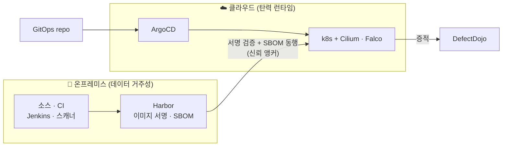
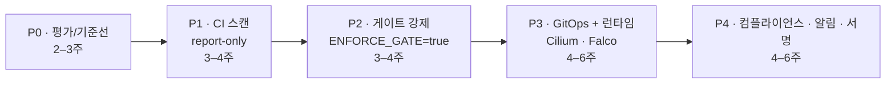

# 도입 가이드 — 무엇이 오픈소스이고, 어떻게 도입하는가

이 프로젝트는 "보안 성숙도를 점수로 매기는 평가 도구"가 아니다. **실제로 서고, 실제로 막고, 그 근거를 증적으로 남기는 DevSecOps Golden Path 그 자체**가 오픈소스다. 이 장은 두 질문에 답한다 — *무엇이 오픈소스이며 어떤 가치를 갖는가*, 그리고 *우리 환경(AWS·온프레미스·하이브리드)에 어떻게 도입하는가*.

---

## 1. 무엇이 오픈소스인가

핵심 구분은 하나다 — **"파이프라인(Golden Path)"은 재사용 대상이고, "워크로드(VulnBank)"는 검증 대상이다.**

-   :material-source-branch-sync:{ .lg .middle } **재사용 대상 = 제품**

    ---

    인프라·파이프라인·정책·증적 규약. 그대로 가져다 자기 워크로드에 적용하는 부분.

    - **IaC** — Terraform 모듈 + user-data 부트스트랩
    - **CI 파이프라인** — Jenkinsfile 18-stage + 스캐너 6종 구성 + Security Gate 정책
    - **GitOps** — ArgoCD app-of-apps + Helm 차트 구조
    - **런타임 보안** — Cilium NetworkPolicy · Falco 룰셋 · kube-bench
    - **증적 파이프라인** — DefectDojo 임포트 + SBOM/리포트 수집 규약
    - **방법론** — 탐지 효능 측정 틀(Recall/Precision) · ISMS-P 매핑

-   :material-flask-outline:{ .lg .middle } **검증 대상 = 테스트 타깃**

    ---

    골든패스가 "실제로 잡는지"를 증명하기 위한 의도된 취약 워크로드. **재사용 대상이 아니라 회귀 테스트 대상**이다.

    - **VulnBank MSA** — 의도된 4개 취약점(음수송금·IDOR×2·웹쉘 RCE)
    - **TerraGoat / KubeGoat** — IaC·K8s 오설정 벤치마크

    > 도입사는 이것을 **자기 워크로드로 교체**한다. 골든패스는 그대로 두고 타깃만 바꾸면 동일한 측정이 나온다.

---

## 2. 어떤 가치를 갖는가 {#value}

대부분의 "보안 평가 도구"는 체크리스트에 자가보고 점수를 매긴다. 이 골든패스는 그 반대다.

| # | 가치 | 평가 도구(scorer)는… | 이 골든패스는… |
| --- | --- | --- | --- |
| 1 | **실행 가능** | 권고안·체크리스트를 출력 | `terraform apply` + GitOps로 파이프라인 자체가 선다 |
| 2 | **증적 기반** | "스캐너 돌렸음"을 자가보고 | "CVE 1,319건 잡아 Gate가 BLOCK" — 빌드 증적이 근거 |
| 3 | **계층방어 정량화** | 단일 점수 | SAST 0/4 → DAST 3/4, 사각을 숫자로 증명 |
| 4 | **재현 가능한 벤치마크** | 환경마다 다른 해석 | 같은 인프라에 워크로드만 넣으면 도구별 커버리지가 동일하게 산출 |
| 5 | **클라우드·벤더 중립** | 특정 제품 종속 | OSS 스택 + 클라우드 중립 코어, 락인 없음 |

$$
\text{가치} = \underbrace{\text{실행 가능}}_{\text{선언이 아님}} \times \underbrace{\text{증적}}_{\text{자가보고가 아님}} \times \underbrace{\text{재현성}}_{\text{환경 독립}}
$$

> **한 줄 정의** — *"스캐너를 어떻게 묶어 source→build→image→deploy→runtime→evidence 전 구간에서 판단 근거를 쌓는가"* 를 코드로 박제한 것. 점수가 아니라 파이프라인이 산출물이다.

---

## 3. 배포 모델 — AWS · 온프레미스 · 하이브리드

도입의 핵심 질문은 "우리는 클라우드가 아닌데 되는가"이다. **된다.** 모든 핵심 보안 컴포넌트가 클라우드 중립이고, AWS 종속은 얇은 접착층 4개뿐이며 전부 온프레미스 등가물로 1:1 교체된다.

### 3.1 이식성 매트릭스 (Portability Matrix)

| 구성요소 | 역할 | 중립 | AWS 구현 | 온프레미스 등가물 |
| --- | --- | :---: | --- | --- |
| Jenkins | CI 오케스트레이션 | ✅ | EC2 | 베어메탈 / VM |
| Harbor | 이미지 레지스트리·서명·스캔 | ✅ | EC2 | 사내 베어메탈 |
| SonarQube · 스캐너 6종 | SAST·IaC·SCA·secret·SBOM | ✅ | EC2 | VM |
| k3s / k8s | 런타임 클러스터 | ✅ | EC2 | 베어메탈 / OpenStack |
| ArgoCD | GitOps 동기화 | ✅ | in-cluster | in-cluster |
| Cilium · Falco · kube-bench | 런타임 제로트러스트·탐지 | ✅ | in-cluster | in-cluster |
| DefectDojo | 증적 집계·트리아지 | ✅ | EC2 | VM |
| — *얇은 접착층 (교체 대상)* — | | | | |
| 관리 접근 | 호스트 접근 | ❌ | SSM Session Manager | Bastion · SSH · Teleport |
| 시크릿 | 자격증명 보관 | ❌ | SSM Param Store | HashiCorp Vault · sealed-secrets |
| 알림 | Gate 결과 통지 | ❌ | SNS (email/SMS) | SMTP · Slack · PagerDuty webhook |
| 노출 | DNS / 로드밸런서 | ❌ | Route53 / ELB | MetalLB · HAProxy · F5 |

> **요지** — ✅ 7개(보안 가치를 만드는 전부)는 어디서나 동일하게 동작한다. ❌ 4개만 환경에 맞춰 갈아끼우면 된다.

### 3.2 세 가지 배포 형태

=== "AWS (현재 PoC)"

    3-VM 컨트롤플레인(CI·증적·런타임) + 타깃. 접근은 SSM Session Manager(SSH 미개방), 알림은 SNS.

    - **장점** — `terraform apply` 한 번으로 전체 기동, 매니지드 탄력성
    - **적합** — 클라우드 네이티브 조직, PoC·교육, 탄력적 CI 부하

=== "온프레미스 (규제·데이터 거주성)"

    전 컴포넌트를 사내에. 접착층만 교체 — 접근 `SSM→Bastion/Teleport`, 시크릿 `Param Store→Vault`, 알림 `SNS→SMTP/Slack`.

    - **air-gap(망분리)** — Trivy 오프라인 DB·SonarQube 플러그인 미러, 내부 미러 레지스트리(Harbor proxy-cache)로 인터넷 단절 환경 대응
    - **적합** — 금융·공공 등 데이터 반출 불가, 기존 데이터센터 자산 활용

=== "하이브리드 (가장 현실적)"

    경계를 넘는 신뢰 앵커는 **서명된 이미지 + SBOM**이다. 두 패턴:

    - **패턴 A** — CI·레지스트리 *온프레*(소스 거주성) + 런타임 클러스터 *클라우드*(버스트). 서명·SBOM가 경계를 넘어 신뢰 전달.
    - **패턴 B** — CI *클라우드*(매니지드 탄력) + 런타임 *온프레*(기존 DC 워크로드). ArgoCD가 클라우드 Git → 온프레 클러스터로 pull.

    - **적합** — 클라우드 전환 과도기, 규제 데이터는 사내·탄력 부하는 클라우드

### 3.3 하이브리드 신뢰 경계

> 경계를 넘는 것은 컨테이너 이미지뿐이고, **서명·SBOM이 그 무결성을 보증**한다. 어느 쪽에 CI가 있든 런타임이 있든 동일한 게이트·동일한 증적 규약이 적용된다.

---

## 4. 단계별 도입 로드맵

빅뱅 적용은 실패한다. **report-only → 게이트 강제 → 런타임 제로트러스트** 순으로, 워크로드별로 시차를 두고 좁혀 들어간다.

| 단계 | 목표 | 게이트 정책 | 완료 기준(Exit) |
| --- | --- | --- | --- |
| **P0** 평가·기준선 | 현황 측정, 의도 취약점·기준선 정의 | 없음 | 워크로드 인벤토리 + 기준 스캔 1회 |
| **P1** CI 스캔(report) | 스캐너 6종 결과 축적, 노이즈 파악 | `ENFORCE_GATE=false` | 빌드마다 SBOM·리포트가 DefectDojo로 |
| **P2** 게이트 강제 | 신규 결함 차단, 워크로드별 시차 적용 | `ENFORCE_GATE=true` CRITICAL 0 / HIGH ≤ 3 | 의도 취약점 빌드가 실제 BLOCK |
| **P3** 런타임 제로트러스트 | 배포 후 행위 탐지·차단 | + Cilium default-deny | Falco/Cilium DROPPED 이벤트 증적 |
| **P4** 컴플라이언스·알림 | 규제 매핑, 통지, 이미지 서명 | + 서명 검증 | ISMS-P 스코어카드 + 알림 발화 |

> 각 단계는 **이전 단계의 증적이 쌓인 뒤** 다음으로 넘어간다 — 게이트를 갑자기 켜면 팀이 우회 경로를 만든다. report-only로 노이즈를 먼저 줄이는 것이 강제 전환의 전제다.

---

## 5. 새 워크로드 온보딩 — 최소 계약(Minimum Workload Contract)

골든패스는 워크로드에 4가지만 요구한다. 이것만 충족하면 PHP든 Go든 Java든 동일 파이프라인을 탄다.

| 요구 | 이유 | 산출물 |
| --- | --- | --- |
| Dockerfile | 이미지 빌드·SBOM·Trivy 스캔 | 컨테이너 이미지 |
| Helm 차트(또는 매니페스트) | GitOps 동기화·Kubescape 검사 | k8s 배포 |
| `/healthz` 프로브 | 배포 검증·ZAP 타깃팅 | 헬스 엔드포인트 |
| (선택) OpenAPI 스펙 | DAST 표면 정의 | ZAP 스캔 범위 |

상세 매핑은 [코드·설정 맵](code-map.md)에서 파이프라인 단계 → 실제 파일 위치로 확인할 수 있다.

---

## 더 읽기

- 도구별 역할·탐지 원리 → [보안 도구 원리](security-tools.md)
- 측정된 탐지 효능(정탐/오탐 수식·차트) → [탐지 효능](detection-efficacy.md)
- 최근 공급망 공격 차단 매핑 → [공급망 방어](supply-chain-defense.md)
- 규제 매핑 → [ISMS-P 매핑](isms-p-mapping.md)
