# Architecture

## Repository model

PoC는 역할별로 3개 정본 repo를 분리한다.

| Repo | 역할 | 주요 파일 |
| --- | --- | --- |
| `devsecops-path` | CI 파이프라인, 보안 스크립트, 부트스트랩, 운영 문서 | `Jenkinsfile.aws-ci`, `scripts/*.sh`, `bootstrap/local-wsl/`, `docs/` |
| `app-source-repo` | VulnBank MSA 애플리케이션 소스 | `examples/vulnbank-msa/services/*`, Dockerfile, OpenAPI |
| `gitops-manifest-repo` | Helm chart, ArgoCD App, Runtime platform manifests | `helm/vulnbank-msa`, `argocd/`, `platform/` |

이 분리는 발표 시 반드시 강조해야 한다. CI repo에는 앱 소스와 Helm chart를 중복으로 들고 가지 않는다. Jenkins는 필요한 시점에 app source repo와 GitOps repo를 추가 checkout한다.

## AWS role model

사용자가 목표로 잡은 모델은 4개 역할이다.

| 역할 | 목적 | 현재 코드 상태 |
| --- | --- | --- |
| CI / Supply Chain VM | Jenkins, Harbor, scanner CLI, SonarQube | Terraform user-data에 반영됨 |
| Runtime k3s VM | k3s, Cilium, ArgoCD, GitOps root app | Terraform user-data에 반영됨 |
| MSA target VM | Runtime과 분리된 공격/검증 대상 또는 별도 workload target | TODO: 현재 Terraform에는 독립 EC2로 분리되어 있지 않음 |
| DefectDojo VM | ASOC findings 통합, triage, accepted risk 관리 | Terraform module과 user-data 초안 존재 |

현재 Terraform 코드에서 확인되는 EC2는 CI, runtime, DefectDojo 3개다. 따라서 문서에서는 4-VM을 목표 성숙도 모델로 표현하고, `msa-target` 분리는 TODO로 둔다.

## Golden Path flow

```mermaid
flowchart LR
    Dev["Developer push"] --> Jenkins["Jenkins CI"]
    Jenkins --> Checkout["multi-repo checkout"]
    Checkout --> Scans["SAST / Secret / IaC / K8s scan"]
    Scans --> Build["Docker build x6"]
    Build --> SBOM["SBOM SPDX + CycloneDX"]
    SBOM --> Trivy["Trivy image scan"]
    Trivy --> Gate["Security Gate"]
    Gate --> Harbor["Harbor registry"]
    Harbor --> GitOps["GitOps image tag update"]
    GitOps --> Argo["ArgoCD sync"]
    Argo --> K3s["k3s runtime"]
    K3s --> Runtime["Cilium / Falco / DAST"]
    Runtime --> Evidence["Evidence & triage"]
```



## Runtime target architecture

```mermaid
flowchart TB
    subgraph CI["CI / Supply Chain VM"]
      Jenkins["Jenkins"]
      Harbor["Harbor"]
      Sonar["SonarQube"]
      Tools["Gitleaks / Checkov / Kubescape / Trivy / SBOM"]
      Jenkins --> Tools
      Jenkins --> Harbor
      Jenkins --> Sonar
    end

    subgraph Runtime["Runtime k3s VM"]
      Cilium["Cilium + Hubble"]
      ArgoCD["ArgoCD"]
      Falco["Falco"]
      KubeBench["kube-bench"]
      ZAP["OWASP ZAP CronJob"]
      App["VulnBank MSA Pods"]
      DB["MariaDB PVC"]
      ArgoCD --> App
      App --> DB
      Cilium --> App
      Falco --> App
      KubeBench --> Runtime
      ZAP --> App
    end

    subgraph Triage["DefectDojo VM"]
      DD["DefectDojo"]
    end

    Harbor --> App
    Tools --> DD
    Runtime --> DD
```

## IaC and bootstrap

Terraform은 VPC, Security Group, IAM instance profile, EC2를 만든다. 각 EC2는 `scripts/user-data/*.sh`로 1회 부트스트랩된다.

| User-data | 역할 |
| --- | --- |
| `ci-server.sh` | Docker, Harbor, Jenkins, scanner CLI, Helm 설치 |
| `runtime-server.sh` | k3s, registry mirror, Cilium, ArgoCD, root Application 적용 |
| `defectdojo-server.sh` | swap, Docker, DefectDojo compose 기반 준비 |

주의: 문서에는 실제 계정 비밀번호와 실제 민감 IP를 남기지 않는다. 예시는 `<CI_VM_PRIVATE_IP>`, `<RUNTIME_VM_PRIVATE_IP>`, `<HARBOR_PASSWORD>`로 표기한다.
