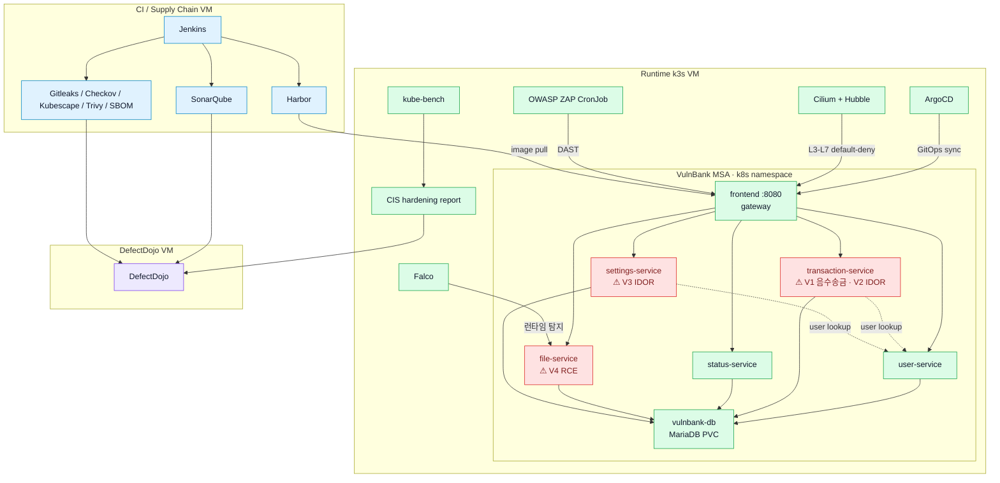

# Architecture

{ loading=lazy }

> 3-VM target 아키텍처 — VulnBank MSA **6개 Pod**(frontend 게이트웨이 + user·transaction·status·file·settings)가 **runtime k3s 네임스페이스** 위에서 동작하고, 의도된 취약 서비스(transaction V1·V2 / file V4 / settings V3)는 빨간 테두리·⚠ 태그로 강조했다. 화살표는 ① 공급망(소스→CI→레지스트리·증적), ② 배포(image pull · GitOps sync), ③ 앱 호출 그래프(게이트웨이→백엔드→DB, user-service 조회), ④ 런타임 통제(Cilium L3-L7 default-deny · Falco 탐지 · ZAP DAST · kube-bench CIS)를 모두 표시한다. `diagram/architecture.py`(diagram-as-code)로 생성되어 **재현 가능**하다. "planned" 표기(Parameter Store 시크릿, CloudWatch, Grafana 보안 대시보드)는 아직 미구현이다.

## Repository model

PoC는 역할별로 3개 정본 repo를 분리한다.

| Repo | 역할 | 주요 파일 |
| --- | --- | --- |
| `devsecops-path` | CI 파이프라인, 보안 스크립트, 부트스트랩, 운영 문서 | `Jenkinsfile.aws-ci`, `scripts/*.sh`, `bootstrap/local-wsl/`, `docs/` |
| `app-source-repo` | VulnBank MSA 애플리케이션 소스 | `examples/vulnbank-msa/services/*`, Dockerfile, OpenAPI |
| `gitops-manifest-repo` | Helm chart, ArgoCD App, Runtime platform manifests | `helm/vulnbank-msa`, `argocd/`, `platform/` |

이 분리는 발표 시 반드시 강조해야 한다. CI repo에는 앱 소스와 Helm chart를 중복으로 들고 가지 않는다. Jenkins는 필요한 시점에 app source repo와 GitOps repo를 추가 checkout한다.

## AWS role model

PoC는 3개 역할 VM으로 구성된다.

| 역할 | 목적 |
| --- | --- |
| CI / Supply Chain VM | Jenkins, Harbor, scanner CLI, SonarQube |
| Runtime k3s VM | k3s, Cilium/Hubble, Falco, kube-bench, ArgoCD, **VulnBank MSA 워크로드** |
| DefectDojo VM | ASOC findings 통합, triage, accepted risk 관리 |

VulnBank는 **runtime k3s 위에 배포**한다 — 그래야 Cilium/Falco 같은 런타임 보안 통제가 실제 취약 앱을 관측·차단할 수 있다(시나리오 #8). 앱을 별도 VM(docker)으로 분리하면 런타임 보안 계층이 앱을 보지 못하므로 채택하지 않는다.

## Golden Path flow

```mermaid
flowchart LR
    Dev["Developer push"] --> Jenkins["Jenkins CI"]
    Jenkins --> Checkout["multi-repo checkout"]
    Checkout --> Scans["SAST / Secret / IaC / K8s scan"]
    Scans --> Build["Docker build x6"]
    Build --> SBOM["SBOM SPDX + CycloneDX"]
    SBOM --> Trivy["Trivy image scan"]
    Trivy --> Gate["Security Gate"]
    Gate --> Harbor["Harbor registry"]
    Harbor --> GitOps["GitOps image tag update"]
    GitOps --> Argo["ArgoCD sync"]
    Argo --> K3s["k3s runtime"]
    K3s --> RuntimeControls["Cilium / Falco / DAST"]
    RuntimeControls --> Evidence["Evidence & triage"]

    classDef source fill:#e0f2fe,stroke:#0284c7,color:#0f172a
    classDef control fill:#ecfeff,stroke:#0891b2,color:#0f172a
    classDef gate fill:#fef3c7,stroke:#d97706,color:#0f172a
    classDef runtime fill:#dcfce7,stroke:#16a34a,color:#0f172a
    class Dev,Jenkins,Checkout source
    class Scans,SBOM,Trivy control
    class Gate gate
    class Harbor,GitOps,Argo,K3s,RuntimeControls,Evidence runtime
```

## Runtime target architecture

## IaC and bootstrap

Terraform은 VPC, Security Group, IAM instance profile, EC2를 만든다. 각 EC2는 `scripts/user-data/*.sh`로 1회 부트스트랩된다.

| User-data | 역할 |
| --- | --- |
| `ci-server.sh` | Docker, Harbor, Jenkins, scanner CLI, Helm 설치 |
| `runtime-server.sh` | k3s, registry mirror, Cilium, ArgoCD, root Application 적용 |
| `defectdojo-server.sh` | swap, Docker, DefectDojo compose 기반 준비 |

주의: 문서에는 실제 계정 비밀번호와 실제 민감 IP를 남기지 않는다. 예시는 `<CI_VM_PRIVATE_IP>`, `<RUNTIME_VM_PRIVATE_IP>`, `<HARBOR_PASSWORD>`로 표기한다.
