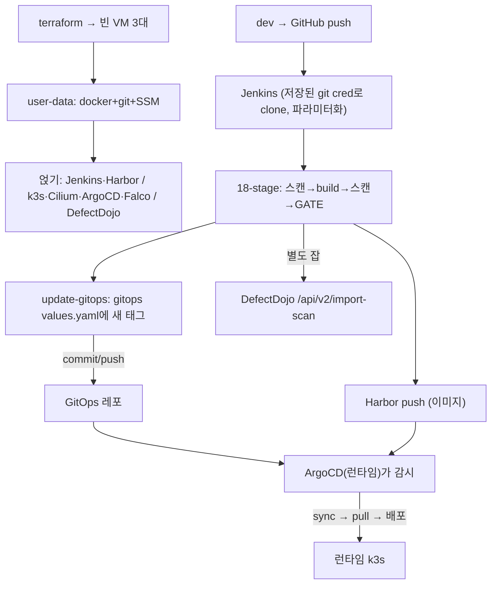

# 구축·연결 원리 — 쌩 VM에서 end-to-end

<div class="sb-lede" markdown>
"빈 VM이 어떻게 이렇게 됐고, GitHub·CD VM·DefectDojo와 어떻게 엮였나." 한 문장으로: **컴포넌트끼리 직접 묶지 않고, 공유 저장소(GitHub·Harbor·GitOps 레포·DefectDojo)를 경유해 느슨하게 연결**했다. 아래는 전부 실제 설정에서 떠온 것.
</div>

## ① 쌩 VM → 작동 (설치)

terraform이 빈 VM 3대를 만들고, 각 VM의 cloud-init **user-data**가 부팅 때 자동 실행된다. 실제 user-data는 *최소 부트스트랩*이다:

```bash title="cloud-init user-data (CI VM 실측)"
dnf install -y docker git jq unzip python3 python3-pip
systemctl enable --now docker
systemctl enable --now amazon-ssm-agent     # ← 이게 있어야 SSM으로 들어온다
```

즉 user-data는 **docker + git + SSM 에이전트**만 깐다. 나머지 무거운 스택(Jenkins·Harbor·SonarQube·DefectDojo)은 그 위에 *얹었다* — Harbor·Sonar·DefectDojo는 docker-compose로, Jenkins는 dnf로, 스캐너는 install 스크립트로. (PoC라 최소 부팅 후 단계적으로 쌓은 구조. 풀 `ci-server.sh`는 `infra-terraform-repo`의 의도 버전이고, 실제 이 VM은 *최소 부트스트랩 + 후속 설치*.)

## ② GitHub 연결

Jenkins 잡 `vulnbank-msa-ci`는 **파라미터화**돼 있다(`config.xml`):

```text
APP_SOURCE_REPO_URL / APP_SOURCE_BRANCH   ← 앱 소스 GitHub 레포
GITOPS_REPO_URL / GITOPS_BRANCH           ← 배포 매니페스트 레포
REGISTRY_URL / PROJECT / USERNAME / PASSWORD   ← Harbor
IMAGE_TAG / ENFORCE_GATE / SERVICES / HELM_CHART_DIR …
```

Jenkins가 이 URL들을 *저장된 git 크리덴셜*(`credentials.xml`)로 clone한다. `checkout scm`(Jenkinsfile 레포) + 멀티레포 체크아웃으로 app-source·gitops를 가져온다.

## ③ Build → Harbor

```bash title="scripts/registry-login.sh (발췌)"
docker login "${REGISTRY_URL}" --username "${REGISTRY_USERNAME}" --password-stdin   # 파라미터로 주입
```
이미지를 빌드해 `10.0.1.169:8082/secubank/vulnbank-msa-<svc>:<TAG>` 로 Harbor에 push한다.

## ④ CI → CD VM 연결 (★ 핵심 — 직접 연결이 아니다)

CI는 런타임 VM에 *접속하지 않는다.* 대신 **GitOps 레포에 새 이미지를 써넣는다**:

```python title="scripts/update-gitops-services.sh — gitops values.yaml 갱신"
updated.append(f"{indent}repository: {registry_url}/{registry_project}/{app_name}-{current_service}\n")
updated.append(f"{indent}tag: {image_tag}\n")
# 그리고 스크립트가 명시: "이 스크립트는 git commit/push를 하지 않는다 —
#                         commit/push는 명시적 CI 정책 결정이어야 한다."
```

commit/push되면 → **ArgoCD(런타임 VM에서 돎)가 그 GitOps 레포를 감시**하다 변경을 감지 → sync → Harbor에서 이미지 pull → 배포.

<div class="sb-key" markdown>
**CI와 CD는 "git 레포 + Harbor 레지스트리"로만 연결된다.** CI는 git·레지스트리에 *쓰고*, CD(ArgoCD)는 거기서 *읽는다*. 직접 SSH/API 연결이 0 — GitOps의 pull 기반 분리([10화](textbook/10-gitops.md)). 한쪽이 죽어도 다른 쪽이 안 무너지고, "운영을 바꾸는 유일한 길은 git"이 되는 이유다.
</div>

## ⑤ DefectDojo로 결과 전송

별도 잡 `secubank-sast-defectdojo-test`가 스캔 JSON을 DefectDojo API로 POST(크리덴셜 `defectdojo-api-token`):

```bash
curl -X POST http://10.0.1.134:8080/api/v2/import-scan/ \
  -H "Authorization: Token $DD_TOKEN" -F "scan_type=Trivy Scan" -F "file=@reports/…"
```

## 한 그림



> 핵심 원리: **직접 묶지 않는다.** GitHub(소스)·Harbor(이미지)·GitOps 레포(배포 선언)·DefectDojo(증적) — 네 개의 공유 저장소가 컴포넌트 사이를 잇는다. 그래서 각자 죽거나 교체돼도 전체가 안 무너진다(느슨한 결합).
