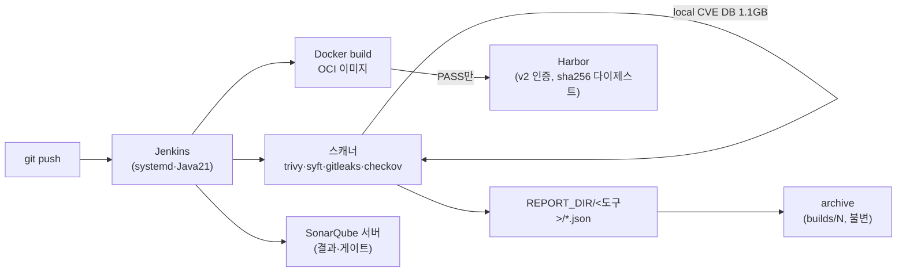

# 기술 심화 · CI 파이프라인 원리

<div class="sb-lede" markdown>
CI도 "Jenkins 깔았다"가 아니라 — 빌드가 *어떻게* 일어나고, 스캐너가 *무엇으로* 판단하며, 이미지가 *어떻게* 보관되는지 그 원리를 봐야 한다. 아래는 전부 CI 노드(`i-01011276c12b34d2c`)에서 SSM로 직접 뽑은 실측이다.
</div>

## Jenkins — 무엇으로 도는가

Jenkins는 systemd 서비스로, `jenkins.war`를 **Java 21**(Amazon Corretto) 위에서 띄운다. controller가 `Jenkinsfile`을 해석하고, 빌드는 *워크스페이스*에서 실행된다.

```text title="실측"
$ systemctl is-active jenkins → active
java-21-amazon-corretto/bin/java ... /usr/share/java/jenkins.war --httpPort=8083
openjdk version "21.0.11"
```

여기에 1화의 그 함정이 박혀 있다 — Java 17로 깔면 이 버전의 Jenkins는 뜨지 않는다. `ci-server.sh`가 `java-21`을 명시한 이유이고, 인프라를 코드로 박으면 *이런 실패의 기억까지* 남는다는 증거다.

## 빌드 엔진 — 호스트 Docker

이미지 빌드는 **Docker 25.0**(호스트 데몬)이 한다. Jenkins 사용자가 docker 그룹에 들어가(1화) 호스트 docker 소켓으로 빌드한다. 결과물은 OCI 이미지다.

```text title="실측"
$ docker version → Server 25.0.14 (active)
```

설계 노트: 파이프라인이 호스트 docker로 빌드한다는 건 *편의이자 위험*이다 — docker 소켓 접근은 사실상 루트 권한이다. 운영 강화 시 rootless/Kaniko/BuildKit으로 격리하는 게 다음 단계다(정직한 한계).

## Harbor — OCI 레지스트리, 그리고 '열려 있지 않다'

빌드된 이미지는 Harbor로 간다. Harbor는 단일 컨테이너가 아니라 **8개 컨테이너의 스택**이다 — core·registry·db·portal·nginx·jobservice·registryctl·log.

```text title="실측 — Harbor 스택 + 인증"
$ docker ps | grep harbor → 8개 컨테이너 (healthy, 2일)
$ curl http://localhost:8082/v2/            → 401
$ curl http://localhost:8082/v2/_catalog    → UNAUTHORIZED
```

**401이 핵심이다.** OCI Distribution API(`/v2/`)가 익명 접근을 거부한다 — 레지스트리가 *열려 있지 않다.* 이미지는 *content-addressable*로 저장된다: 같은 내용이면 같은 `sha256:` 다이제스트, 내용을 한 비트라도 바꾸면 다이제스트가 바뀐다. 그래서 "이 다이제스트의 이미지"를 배포한다는 건 *변조되지 않았음*을 가리킨다 — 무결성의 기초다. (다만 *서명*까지는 아직 — Cosign/Kyverno는 로드맵.)

## 스캐너는 무엇으로 '판단'하는가

스캐너마다 판단의 *재료*가 다르다. 그걸 알아야 한계도 안다.

- **Trivy** — SBOM의 패키지를 *로컬 취약점 DB*와 대조한다. 그 DB가 실재한다.
```text title="실측 — Trivy DB"
/var/lib/jenkins/.cache/trivy/db/trivy.db   →  1.1 GB
metadata.json                               →  DB 버전·갱신 시각
```
1.1GB의 *known-CVE* 데이터베이스. 그래서 [7화](textbook/07-trivy.md)의 결론이 구조적으로 옳다 — **이 DB에 없는 0-day는 못 잡는다.** 그리고 [8화](textbook/08-sbom-rescan.md)의 시간축 재평가는 *이 DB를 갱신해 같은 SBOM을 다시 대조*하는 것이다. DB가 매칭의 전부이므로, DB의 신선도가 곧 탐지력이다.

- **syft** — 이미지 레이어를 풀어 설치된 패키지 목록(SBOM)을 만든다. Trivy가 대조할 *재료*를 생산한다. "무엇이 들었는지"(syft) → "무엇이 취약한지"(trivy)의 순서.
- **gitleaks 8.30 / checkov 3.2** — 각각 시크릿(정규식+엔트로피), IaC 미스컨피그(룰). 입력이 다르다: gitleaks는 git 히스토리, checkov는 매니페스트.
- **SonarQube** — 이건 CLI가 아니라 **서버**다.
```text title="실측"
$ docker ps | grep sonar → sonarqube (up 46h)
$ curl http://localhost:9000/api/system/status → 200
```
스캐너가 분석 결과를 *서버에 올리고*, Quality Gate 통과 여부를 서버에 *되묻는다*([4화](textbook/04-sast.md)). 그래서 SonarQube만 결과가 파일이 아니라 서버에 산다.

## REPORT_DIR — 워크스페이스에서 archive로

빌드는 *휘발성* 워크스페이스에서 돌고, 증적은 *불변* 보관소로 복사된다. 이 두 경로가 실제로 존재한다.

```text title="실측 — 같은 빌드 #3의 두 경로"
워크스페이스(휘발): /var/lib/jenkins/workspace/vulnbank-msa-ci/reports/dev/3/gate/msa-gate-summary.txt
영구 보관(불변)  : /var/lib/jenkins/jobs/vulnbank-msa-ci/builds/3/archive/reports/dev/3/gate/msa-gate-summary.txt
```

워크스페이스는 다음 빌드에 덮어쓰인다. 하지만 `archiveArtifacts`가 빌드번호별 `builds/<N>/archive/`로 *불변 보존*한다([9화](textbook/09-security-gate.md)·[유스케이스 UC15](usecases.md)). "3번 빌드가 무엇을 발견했나"를 몇 달 뒤에도 답할 수 있는 이유다 — 감사의 물리적 토대가 이 디렉터리다.

## 한 장으로



## 시니어의 네 렌즈로

기술적으로, CI는 *호스트 docker 빌드 + 로컬 DB 매칭 스캐너 + 서버형 SAST + 불변 archive*의 조합이다 — 각 도구의 입력(git/매니페스트/이미지/SBOM)과 판단 재료(정규식/룰/CVE DB)가 다르다는 걸 알아야 한계가 보인다. 규제로 옮기면, 인증을 요구하는 레지스터리(`/v2/`→401)와 빌드별 불변 archive는 ISMS-P 2.8(개발 보안)·2.9(변경·증적)의 "검증 절차의 표준화·기록"을 물리적으로 충족한다. 정책의 영역에서, 무엇을 빌드 엔진으로 쓰고(docker vs rootless) 레지스트리 접근을 어떻게 통제하는지가 곧 공급 경로의 정책이다. 관리의 영역에서, Trivy DB의 *신선도*와 archive의 *보존 기간*을 누가 책임지는지가 탐지력과 감사 가능성을 좌우한다 — 도구는 깔려 있으나, 그 도구의 *재료를 최신으로 유지하는 운영*이 실제 보안 수준을 만든다.

<div class="sb-key" markdown>
"CI를 구축했다"는 사실 — *호스트 docker로 OCI 이미지를 만들고, 1.1GB CVE DB로 known-bad를 대조하고, 서버형 SAST에 되묻고, 통과분만 인증된 레지스트리로 보내, 빌드별로 불변 보존한다*는 흐름을 받았다는 뜻이다. 각 단계의 *원리*를 알면, 어디가 강하고(알려진 CVE) 어디가 사각인지(0-day·서명 부재)가 보인다.
</div>
