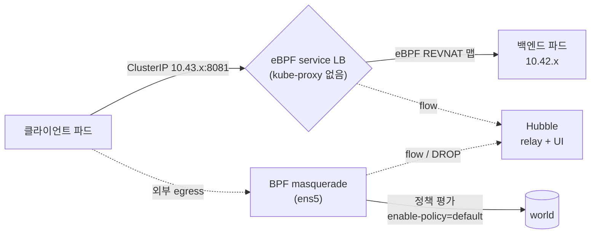

# 기술 심화 · k3s + Cilium 동작 원리

<div class="sb-lede" markdown>
매니지드 쿠버네티스(EKS 등)와 달리, 우리는 CNI와 데이터패스를 *직접* 책임진다. 그래서 이 장은 도구 이름이 아니라 — **무엇을 자동화하고, 무엇을 감추는가**로 본다. 아래 수치는 전부 런타임 노드(`i-05d583e02dcb52aef`)에서 SSM로 직접 뽑은 실측이다.
</div>

## k3s — 단일 바이너리가 묶는 것, 우리가 빼낸 것

k3s는 containerd·kubelet·flannel·서비스LB를 *한 바이너리*에 묶어 supervisor가 띄운다. 엣지·폐쇄망에서 K3s/RKE2 같은 단일 바이너리 배포판이 선호되는 이유 — 의존성을 감추고 배포를 단순화한다. 대신 그 "감춤"이 곧 트레이드오프다. 우리는 그 묶음에서 **네트워킹만 빼냈다.**

```text title="k3s 기동 플래그 (실측)"
flannel-backend=none          # 기본 CNI(flannel)를 끈다
disable-network-policy        # k3s 내장 NetworkPolicy 컨트롤러도 끈다 → Cilium에 위임
```

그 결과 노드의 CNI 설정은 Cilium 하나뿐이다.

```text title="런타임 노드 실측"
/etc/cni/net.d/05-cilium.conflist        # CNI = Cilium (단독)
CNI Chaining: none                        # 다른 CNI 위에 얹은 게 아니라 단독
node ip-10-0-1-20 ... Ready  v1.35.5+k3s1
```

여기까지가 첫 결정이다 — 단일 바이너리의 편의는 취하되, 핵심은 직접 통제한다. 그 '핵심'이 무엇인지, 먼저 두뇌(컨트롤 플레인)부터 본다.

## 컨트롤 플레인 — 한 프로세스 안의 쿠버네티스

쿠버네티스의 두뇌는 네 부품이다 — **API 서버**(모든 요청의 단일 관문), **상태 저장소**(etcd), **스케줄러**(파드를 노드에 배치), **컨트롤러 매니저**(원하는 상태와 실제를 맞추는 reconcile 루프). kubeadm 클러스터라면 이 넷이 *static pod*로 뜬다 — kubelet이 `/etc/kubernetes/manifests`를 감시해 띄운다. 우리 k3s는 다르다. **넷 전부가 `k3s server` 한 프로세스 안의 goroutine**이다.

```text title="실측 — control plane이 무엇으로 실행되나"
$ ps -ef | grep 'k3s server'
/usr/local/bin/k3s server         # ← 이 하나가 apiserver+scheduler+controller+kine 전부
$ kubectl get pods -n kube-system | grep -E 'apiserver|scheduler|controller|etcd'
(없음)                             # ← 컨트롤 플레인은 '파드'가 아니다
```

kube-system에 뜬 건 *애드온*뿐이다(coredns·metrics-server·local-path·Cilium). 컨트롤 플레인 자체는 보이지 않는다 — 바이너리에 숨어 있다. 이게 단일 바이너리 배포판이 "감추는" 것이고, 엣지·폐쇄망에서 운영이 단순해지는 이유다. 대신 다중 컨트롤 플레인(HA)은 별도 구성을 해야 한다.

### 상태 저장소 — etcd가 아니라 kine→SQLite

여기가 가장 흥미롭다. 보통 쿠버네티스의 상태는 **etcd**(분산 KV, 정족수 기반)에 산다 — etcd가 정족수(quorum)를 잃으면 클러스터가 split-brain에 빠진다. 그런데 우리 단일 노드 k3s를 까보면 etcd 프로세스가 *없다.*

```text title="실측 — datastore"
$ ls /var/lib/rancher/k3s/server/db/
state.db   state.db-wal   state.db-shm      # ← SQLite 파일 (state.db = 34MB)
$ file state.db
state.db: SQLite 3.x database              # etcd가 아니라 SQLite
$ kubectl get --raw=/readyz?verbose | grep etcd
[+]etcd ok                                  # ← 그런데 apiserver는 'etcd ok'라고 한다?
```

비밀은 **kine**이다. kine은 etcd API를 SQLite(또는 MySQL·Postgres)로 *번역*하는 shim이다. API 서버는 자기가 etcd와 말한다고 믿지만(그래서 `[+]etcd ok`), 실제로는 SQLite에 쓴다. 단일 노드에선 정족수도 split-brain도 없다 — *단순함을 얻고 HA를 포기한* 트레이드오프다. (HA가 필요하면 k3s는 embedded etcd 모드로 전환한다.)

### 선언과 조정 — reconcile 루프가 도는 증거

쿠버네티스가 명령형이 아니라 *선언형*이라는 말의 실체가 이것이다. 우리는 "원하는 상태"(spec)를 적고, 컨트롤러가 *실제 상태*(status)를 거기에 맞춘다 — 끊임없이.

```text title="실측 — Deployment 컨트롤러의 reconcile"
$ kubectl get deploy -n secure-path-dev
NAME                  DESIRED   READY
user-service          1         1       # desired=actual → 루프가 수렴한 상태
transaction-service   1         1
… (7개 전부 1/1)
```

파드를 죽이면 desired(1)≠actual(0)이 되고, Deployment 컨트롤러가 즉시 새 파드를 만들어 다시 1/1로 수렴시킨다. [10화](textbook/10-gitops.md)의 GitOps self-heal이 이 원리의 *한 층 위*다 — ArgoCD가 "git=desired"를 클러스터에 맞추고, 그 안에서 다시 K8s 컨트롤러가 "spec=desired"를 파드에 맞춘다. 조정 루프가 이중으로 도는 것이다.

### PKI — 모든 통신이 상호 TLS

API 서버·kubelet·컨트롤러는 전부 *인증서*로 서로를 인증한다(mutual TLS). The Hard Way라면 OpenSSL로 이 인증서들을 일일이 발급해야 한다. k3s는 자동으로 발급·갱신한다.

```text title="실측 — k3s가 자동 발급한 PKI"
/var/lib/rancher/k3s/server/tls/
  client-ca.crt   server-ca.crt   request-header-ca.crt    # 3개의 CA
  client-kube-apiserver.crt  client-scheduler.crt  …       # 컴포넌트별 클라이언트 인증서
  serving-kube-apiserver.crt                               # API 서버 serving 인증서
```

세 개의 CA가 핵심이다 — *client-ca*(컴포넌트가 API 서버에 자신을 인증), *server-ca*(API 서버가 신원을 증명), *request-header-ca*(aggregation layer). 이 인증서가 만료되면 API 접근이 막힌다 — `kubeconfig`에 박힌 클라이언트 인증서도 마찬가지다. k3s가 갱신을 자동화하지만, *왜 막히는지*를 알아야 장애를 복구할 수 있다.

> 정리하면, "k3s를 깔았다"는 사실 *API 서버라는 단일 관문 + kine이 위장한 etcd + reconcile 루프 + 자동 PKI*를 한 바이너리로 받았다는 뜻이다. 매니지드(EKS)는 이 전부를 감추고, The Hard Way는 전부 손으로 시킨다. k3s는 그 사이에서 "자동화하되 들여다볼 수 있는" 자리를 잡는다.

---

이제 그 컨트롤 플레인이 띄운 파드들이 *어떻게 통신하는가* — 네트워킹으로 내려간다. 그리고 여기서 또 하나를 직접 통제했다.

## kube-proxy를 대체한다 — iptables가 아니라 eBPF

보통 클러스터에는 `kube-proxy` DaemonSet이 있고, 서비스 ClusterIP를 노드마다 *iptables 룰*로 푼다. 트래픽이 많아지면 iptables 체인이 길어지고 느려진다. 우리 클러스터를 확인하면 —

```text title="실측 — kube-proxy가 없다"
$ kubectl get ds -n kube-system | grep kube-proxy
NO kube-proxy DaemonSet
$ kubectl get pods -A | grep kube-proxy
NO kube-proxy pod
```

kube-proxy가 *아예 없다.* 대신 Cilium이 그 일을 **eBPF 맵**으로 한다.

```text title="cilium-config 실측"
kube-proxy-replacement = true
enable-bpf-masquerade  = true
identity-allocation-mode = crd
routing-mode = tunnel / tunnel-protocol = vxlan
enable-l7-proxy = true        # L7 능력은 켜짐(엔보이 대기) — 단 L7 정책은 아직 미적용
enable-policy   = default     # ★ 정책이 없으면 '전부 허용'이 기본
```

서비스→백엔드 매핑이 iptables가 아니라 *eBPF 로드밸런서 맵*에 박혀 있는 걸 직접 볼 수 있다.

```text title="cilium-dbg bpf lb list (실측 일부)"
SERVICE ADDRESS              BACKEND ADDRESS
10.43.245.145:8081/TCP   →   10.42.0.93:8081     # ClusterIP를 eBPF가 백엔드로 분배
0.0.0.0:32000/TCP        →   10.42.0.217:8081    # NodePort도 eBPF로
```

**무엇을 자동화하나**: 서비스 IP 관리를 위한 iptables 체인 생성·갱신 전체. **무엇을 감추나**: 패킷이 커널 eBPF 훅에서 처리되므로 `iptables -L`로는 보이지 않는다 — 디버깅 모델 자체가 바뀐다(`cilium-dbg bpf lb list`로 봐야 한다). 이게 "감춤"의 비용이다. eBPF는 빠르지만, *어디를 봐야 하는지*를 새로 배워야 한다.

## 데이터패스 — vxlan 터널 + BPF masquerade



노드 간 파드 트래픽은 **vxlan으로 캡슐화**(routing-mode=tunnel)되고, 파드가 외부로 나갈 때는 **BPF masquerade**로 노드 IP(ens5)로 치환된다. 둘 다 iptables가 아니라 eBPF가 한다. Direct Routing 모드(`KubeProxyReplacement: True [ens5 ... Direct Routing]`)로 노드 로컬 처리는 직접 라우팅한다.

## identity — IP가 아니라 '정체성'으로 본다

Cilium은 파드를 *IP*가 아니라 **라벨에서 파생한 identity**로 식별한다(`identity-allocation-mode = crd`). 그래서 파드가 재시작돼 IP가 바뀌어도 정책은 그대로 유지된다.

```text title="ciliumidentities 실측 (네임스페이스별 워크로드 정체성)"
ID 11654  NS secure-path-dev      # 우리 VulnBank 워크로드
ID 31575  NS secure-path-dev
ID 10731  NS argocd
ID 12023  NS monitoring
…  총 endpoint 24 / identity 24
```

11화에서 egress 정책을 *"파드"*에 걸 수 있었던 게 이 모델 덕이다 — 정책은 IP 목록이 아니라 identity(=워크로드)에 붙는다.

## Hubble — 무엇을 보이게 하나

```text title="cilium status — Hubble (실측)"
Hubble:  Ok   Current/Max Flows: 4095/4095 (100%), Flows/s: 29.49
파드:    hubble-relay (Running) + hubble-ui (Running)
```

Hubble은 eBPF 데이터패스를 흐르는 *모든 flow*를 관측한다 — 허용도, **DROP도**. 11화에서 egress 차단을 `Policy denied DROPPED (TCP Flags: SYN)`로 캡처할 수 있었던 게 이 관측면 덕이다. CLI만이 아니라 relay + UI까지 떠 있어, 실시간 flow 그래프를 브라우저로 볼 수 있다.

## 무엇을 쓰고, 무엇을 갖고만 있나 (정직)

여기가 이 장의 핵심이자, 이 PoC의 정직한 현재 위치다.

| Cilium 능력 | 상태 | 근거(실측) |
| --- | --- | --- |
| CNI(단독, flannel 대체) | <span class="st st--done">사용</span> | `05-cilium.conflist`, CNI Chaining none |
| kube-proxy 대체(eBPF LB) | <span class="st st--done">사용</span> | kube-proxy 부재 + eBPF LB 맵 |
| BPF masquerade / vxlan | <span class="st st--done">사용</span> | cilium-config |
| identity 기반 모델 | <span class="st st--done">사용</span> | 24 identities (CRD) |
| Hubble 관측(relay+UI) | <span class="st st--done">사용</span> | 4095 flows |
| **상시 egress 차단(CNP)** | <span class="st st--done">상시 적용·검증</span> | `secure-path-dev-egress-baseline` — 앱 정상 + world DROP (아래 절) |
| L7 정책 | <span class="st st--planned">미사용</span> | `enable-l7-proxy=true`지만 L7 CNP 없음 |
| 노드간 암호화 | <span class="st st--planned">꺼짐</span> | Encryption Disabled |
| Host firewall | <span class="st st--planned">꺼짐</span> | Host firewall Disabled |

<div class="sb-key" markdown>
정직한 한 줄: **데이터패스·관측면을 제대로 세웠고, 상시 egress 정책으로 world 차단을 *enforcement*까지 닫았다.** 남은 빈칸은 고급 기능(L7·암호화·host firewall)이다. `enable-policy=default`라 정책이 없으면 전부 흐르므로, 아래 `secure-path-dev-egress-baseline`이 곧 상시 강제의 근거다 — 11화의 *1회 실증*을 *상시 적용*으로 올린 것.
</div>

## 상시 egress 정책 — 적용하고, 검증했다

11화는 egress 차단을 *한 번 보여주고 롤백*했다. 이번엔 `secure-path-dev`에 정책을 **상시로 걸고**, 앱이 멀쩡한지와 외부가 막히는지를 라이브로 확인했다.

```yaml title="secure-path-dev-egress-baseline (요약)"
spec:
  endpointSelector: {}        # 네임스페이스 전 파드
  egress:
    - toEntities: [cluster]    # 클러스터 내부(DNS·서비스·DB) 허용
    # world는 명시 안 함 → DROP
```

설계의 핵심은 *허용 목록*이다. 외부로 나가는 정상 트래픽이 없음을 Hubble로 먼저 관측한 뒤(자체완결형 앱), `cluster` 엔티티만 허용하고 world를 비웠다. 적용 후 실측은 이렇다.

```text title="검증 실측 (런타임 노드, SSM)"
앱 정상 :  vulnbank-db:3306 연결 OK · vulnbank-msa-frontend:8080 /healthz = {"status":"ok"}
world 차단: user-service → 1.1.1.1:80  →  Connection timed out
Hubble :  secure-path-dev/user-service (ID:31575) <> 1.1.1.1:80 (world)
          Policy denied DROPPED (TCP Flags: SYN)
범위   :  secure-path-dev 한정 (argocd 등 타 네임스페이스 무영향)
```

`ID:31575`는 앞 절에서 본 secure-path-dev의 identity다 — 정책이 *IP가 아니라 워크로드 정체성*에 걸렸다는 증거다. 이제 이 차단은 1회성이 아니라 *클러스터에 상주*하며, 매니페스트는 `manifests/cilium/`에 버전관리되어 "운영 변경은 git을 통한다"는 [10화](textbook/10-gitops.md) 원칙과도 맞는다. 한 번의 시행착오도 정직하게 남긴다 — 처음엔 네임스페이스 라벨만으로 DNS를 열려다 이름해석이 끊겨, `toEntities: cluster`로 바로잡았다.

## 그래서 이 접근이 의미하는 것

매니지드(EKS)는 이 전부를 감춘다 — 편하지만 *왜 막혔는지*를 설명하기 어렵다. 우리는 직접 세웠기에, "ClusterIP가 어떻게 풀리고(eBPF LB), 파드가 어떻게 식별되고(identity), 트래픽이 어디서 끊기는지(정책+Hubble)"를 *수치로* 말할 수 있다. 통제력과 운영 부담의 트레이드오프이고, 어느 쪽이든 — 데이터패스·정체성·정책의 동작 원리를 알아야 장애와 침해에 대응할 수 있다. 이 페이지가 그 원리를 우리 클러스터의 실측으로 적은 이유다.
