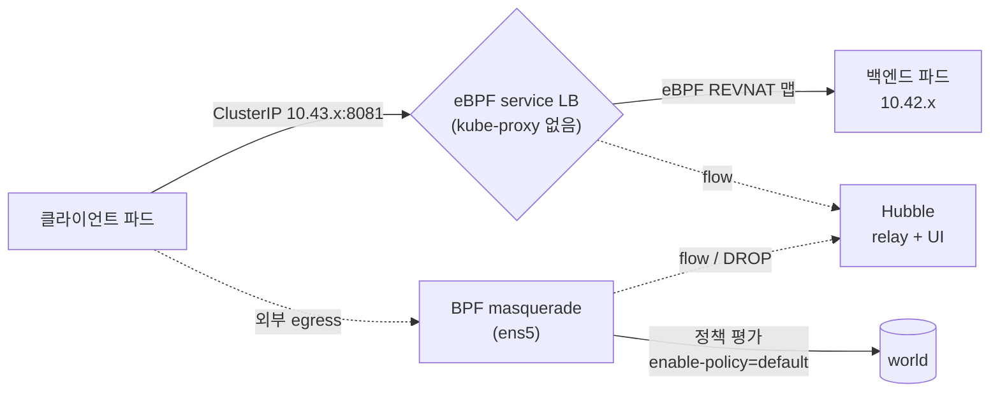

# 기술 심화 · k3s + Cilium 동작 원리

<div class="sb-lede" markdown>
매니지드 쿠버네티스(EKS 등)와 달리, 우리는 CNI와 데이터패스를 *직접* 책임진다. 그래서 이 장은 도구 이름이 아니라 — **무엇을 자동화하고, 무엇을 감추는가**로 본다. 아래 수치는 전부 런타임 노드(`i-05d583e02dcb52aef`)에서 SSM로 직접 뽑은 실측이다.
</div>

## k3s — 단일 바이너리가 묶는 것, 우리가 빼낸 것

k3s는 containerd·kubelet·flannel·서비스LB를 *한 바이너리*에 묶어 supervisor가 띄운다. 엣지·폐쇄망에서 K3s/RKE2 같은 단일 바이너리 배포판이 선호되는 이유 — 의존성을 감추고 배포를 단순화한다. 대신 그 "감춤"이 곧 트레이드오프다. 우리는 그 묶음에서 **네트워킹만 빼냈다.**

```text title="k3s 기동 플래그 (실측)"
flannel-backend=none          # 기본 CNI(flannel)를 끈다
disable-network-policy        # k3s 내장 NetworkPolicy 컨트롤러도 끈다 → Cilium에 위임
```

그 결과 노드의 CNI 설정은 Cilium 하나뿐이다.

```text title="런타임 노드 실측"
/etc/cni/net.d/05-cilium.conflist        # CNI = Cilium (단독)
CNI Chaining: none                        # 다른 CNI 위에 얹은 게 아니라 단독
node ip-10-0-1-20 ... Ready  v1.35.5+k3s1
```

여기까지가 첫 결정이다 — *"단일 바이너리의 편의는 취하되, 네트워킹은 직접 통제한다."*

## kube-proxy를 대체한다 — iptables가 아니라 eBPF

보통 클러스터에는 `kube-proxy` DaemonSet이 있고, 서비스 ClusterIP를 노드마다 *iptables 룰*로 푼다. 트래픽이 많아지면 iptables 체인이 길어지고 느려진다. 우리 클러스터를 확인하면 —

```text title="실측 — kube-proxy가 없다"
$ kubectl get ds -n kube-system | grep kube-proxy
NO kube-proxy DaemonSet
$ kubectl get pods -A | grep kube-proxy
NO kube-proxy pod
```

kube-proxy가 *아예 없다.* 대신 Cilium이 그 일을 **eBPF 맵**으로 한다.

```text title="cilium-config 실측"
kube-proxy-replacement = true
enable-bpf-masquerade  = true
identity-allocation-mode = crd
routing-mode = tunnel / tunnel-protocol = vxlan
enable-l7-proxy = true        # L7 능력은 켜짐(엔보이 대기) — 단 L7 정책은 아직 미적용
enable-policy   = default     # ★ 정책이 없으면 '전부 허용'이 기본
```

서비스→백엔드 매핑이 iptables가 아니라 *eBPF 로드밸런서 맵*에 박혀 있는 걸 직접 볼 수 있다.

```text title="cilium-dbg bpf lb list (실측 일부)"
SERVICE ADDRESS              BACKEND ADDRESS
10.43.245.145:8081/TCP   →   10.42.0.93:8081     # ClusterIP를 eBPF가 백엔드로 분배
0.0.0.0:32000/TCP        →   10.42.0.217:8081    # NodePort도 eBPF로
```

**무엇을 자동화하나**: 서비스 IP 관리를 위한 iptables 체인 생성·갱신 전체. **무엇을 감추나**: 패킷이 커널 eBPF 훅에서 처리되므로 `iptables -L`로는 보이지 않는다 — 디버깅 모델 자체가 바뀐다(`cilium-dbg bpf lb list`로 봐야 한다). 이게 "감춤"의 비용이다. eBPF는 빠르지만, *어디를 봐야 하는지*를 새로 배워야 한다.

## 데이터패스 — vxlan 터널 + BPF masquerade



노드 간 파드 트래픽은 **vxlan으로 캡슐화**(routing-mode=tunnel)되고, 파드가 외부로 나갈 때는 **BPF masquerade**로 노드 IP(ens5)로 치환된다. 둘 다 iptables가 아니라 eBPF가 한다. Direct Routing 모드(`KubeProxyReplacement: True [ens5 ... Direct Routing]`)로 노드 로컬 처리는 직접 라우팅한다.

## identity — IP가 아니라 '정체성'으로 본다

Cilium은 파드를 *IP*가 아니라 **라벨에서 파생한 identity**로 식별한다(`identity-allocation-mode = crd`). 그래서 파드가 재시작돼 IP가 바뀌어도 정책은 그대로 유지된다.

```text title="ciliumidentities 실측 (네임스페이스별 워크로드 정체성)"
ID 11654  NS secure-path-dev      # 우리 VulnBank 워크로드
ID 31575  NS secure-path-dev
ID 10731  NS argocd
ID 12023  NS monitoring
…  총 endpoint 24 / identity 24
```

11화에서 egress 정책을 *"파드"*에 걸 수 있었던 게 이 모델 덕이다 — 정책은 IP 목록이 아니라 identity(=워크로드)에 붙는다.

## Hubble — 무엇을 보이게 하나

```text title="cilium status — Hubble (실측)"
Hubble:  Ok   Current/Max Flows: 4095/4095 (100%), Flows/s: 29.49
파드:    hubble-relay (Running) + hubble-ui (Running)
```

Hubble은 eBPF 데이터패스를 흐르는 *모든 flow*를 관측한다 — 허용도, **DROP도**. 11화에서 egress 차단을 `Policy denied DROPPED (TCP Flags: SYN)`로 캡처할 수 있었던 게 이 관측면 덕이다. CLI만이 아니라 relay + UI까지 떠 있어, 실시간 flow 그래프를 브라우저로 볼 수 있다.

## 무엇을 쓰고, 무엇을 갖고만 있나 (정직)

여기가 이 장의 핵심이자, 이 PoC의 정직한 현재 위치다.

| Cilium 능력 | 상태 | 근거(실측) |
| --- | --- | --- |
| CNI(단독, flannel 대체) | <span class="st st--done">사용</span> | `05-cilium.conflist`, CNI Chaining none |
| kube-proxy 대체(eBPF LB) | <span class="st st--done">사용</span> | kube-proxy 부재 + eBPF LB 맵 |
| BPF masquerade / vxlan | <span class="st st--done">사용</span> | cilium-config |
| identity 기반 모델 | <span class="st st--done">사용</span> | 24 identities (CRD) |
| Hubble 관측(relay+UI) | <span class="st st--done">사용</span> | 4095 flows |
| egress 차단(CNP) | <span class="st st--partial">1회 실증</span> | cmd `ba96945a` DROP — **상시 적용은 아님** |
| **상시 NetworkPolicy** | <span class="st st--planned">없음</span> | `kubectl get cnp -A` 비어 있음, `enable-policy=default`(전부 허용) |
| L7 정책 | <span class="st st--planned">미사용</span> | `enable-l7-proxy=true`지만 L7 CNP 없음 |
| 노드간 암호화 | <span class="st st--planned">꺼짐</span> | Encryption Disabled |
| Host firewall | <span class="st st--planned">꺼짐</span> | Host firewall Disabled |

<div class="sb-key" markdown>
정직한 한 줄: **데이터패스와 관측면은 제대로 세웠다. 비어 있는 건 *상시 강제(정책)*와 고급 기능(L7·암호화·host firewall)이다.** `enable-policy=default`라 — 정책을 걸지 않으면 트래픽은 전부 흐른다. 그래서 "egress를 막는다"는 1회 실증은 진짜지만, *지금 이 순간 막고 있지는 않다.* 다음 단계는 이 빈칸 중 하나(상시 egress 정책)를 닫고 Hubble로 *지속* 검증하는 것이다.
</div>

## 그래서 이 접근이 의미하는 것

매니지드(EKS)는 이 전부를 감춘다 — 편하지만 *왜 막혔는지*를 설명하기 어렵다. 우리는 직접 세웠기에, "ClusterIP가 어떻게 풀리고(eBPF LB), 파드가 어떻게 식별되고(identity), 트래픽이 어디서 끊기는지(정책+Hubble)"를 *수치로* 말할 수 있다. 통제력과 운영 부담의 트레이드오프이고, 어느 쪽이든 — 데이터패스·정체성·정책의 동작 원리를 알아야 장애와 침해에 대응할 수 있다. 이 페이지가 그 원리를 우리 클러스터의 실측으로 적은 이유다.
