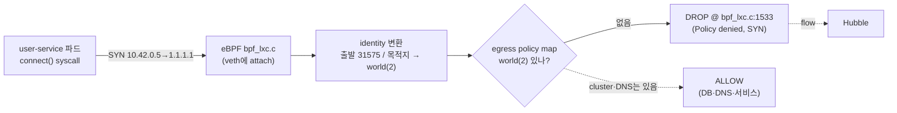
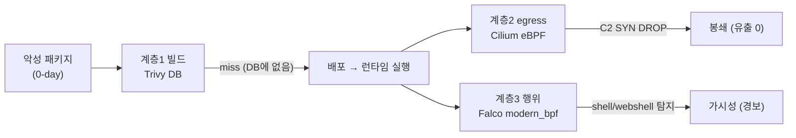

# 기술 심화 · 메커니즘 해부 & 장애 복기

<div class="sb-lede" markdown>
앞의 두 면이 "어떻게 구성됐나"였다면, 이 면은 한 단계 더 내려간다 — 정책이 *커널 어디서* 트래픽을 끊는지, 컨트롤 플레인이 *무엇으로* 망가지는지, 공급망 공격이 *각 계층 어디서* 잡히고 놓치는지. 아래는 전부 오늘 라이브 클러스터에서 직접 떠서 캡처한 것이다.
</div>

## A. egress 차단의 verdict를 커널까지 내려가 본다

11화와 심화에서 "egress를 막는다"고 했다. 그게 *커널 어디서, 무엇을 보고* 막는지 끝까지 따라가 본다. user-service 파드에서 외부 `1.1.1.1`로 나가게 해놓고, eBPF 데이터패스를 그대로 떴다.

```text title="live verdict — cilium monitor (런타임 노드, SSM)"
xx drop (Policy denied) flow 0x85149827 to endpoint 0, ifindex 107,
   file bpf_lxc.c:1533, identity 31575->world: 10.42.0.5:35008 -> 1.1.1.1:80 tcp SYN
```

이 한 줄에 verdict의 전 과정이 들어 있다.

1. **패킷** — `10.42.0.5:35008 → 1.1.1.1:80 tcp SYN`. TCP 3-way handshake의 *첫 SYN*이다. 연결이 시작되기도 전이다.
2. **eBPF 프로그램** — `file bpf_lxc.c:1533`. 파드의 veth에 붙은 Cilium eBPF 프로그램(`bpf_lxc.c`)의 *바로 그 줄*이 판정을 내렸다. iptables가 아니다.
3. **identity 변환** — `identity 31575->world`. 출발지는 IP가 아니라 *identity 31575*(user-service)로, 목적지 `1.1.1.1`은 ipcache에서 *identity 2(world)*로 해석된다.
4. **policy map 조회** — 그 endpoint의 egress 정책 맵을 보면, 허용된 identity가 *전부 클러스터 내부*다.

```text title="endpoint 3566(=user-service, identity 31575)의 egress policy map"
EGRESS_ENFORCE = egress          # ← 이 endpoint는 egress 정책이 '강제' 상태
Allow Egress  reserved:host / reserved:remote-node / reserved:kube-apiserver / …
Allow Egress  k8s:…name=vulnbank-db            (260 bytes, 4 packets)   # DB 연결 실제 흐름
Allow Egress  k8s:…namespace=kube-system  53/UDP  (3638 bytes, 36 pkts) # DNS 실제 흐름
Allow Egress  k8s:…name=transaction-service / settings-service / …
# reserved:world(identity 2) 항목은 — 없다
```

`toEntities: cluster`라고 적은 한 줄이, Cilium에 의해 *클러스터에 실재하는 identity 하나하나*로 펼쳐져 eBPF 맵에 박혔다. host·remote-node·각 워크로드·DNS는 있고, **world(2)는 없다.** 그래서 31575→world 조회는 *맵에 없음 → Policy denied → drop.* 그것도 SYN에서. 데이터가 한 바이트도 나가기 전에 끊긴다.



핵심은 셋이다 — **정책은 IP가 아니라 identity로 평가**되고(파드 IP가 바뀌어도 유지), **판정은 커널 eBPF에서**(iptables 우회), **차단은 SYN에서**(연결 자체가 성립 안 됨). "막는다"의 실체가 이 verdict 한 줄이다.

## B. 컨트롤 플레인은 무엇으로 망가지는가 — kine/SQLite와 인증서

CloudNet@ 글이 etcd 정족수·split-brain·인증서 만료를 직접 재현했다. 우리 클러스터는 etcd가 아니라 kine→SQLite다. 그래서 *같은 질문의 답이 다르다.* (라이브 클러스터를 실제로 깨뜨리진 않았다 — 상태와 복구 경로만 떴다.)

### etcd가 없으면 split-brain도 없다 — 대신 단일점

```text title="datastore 실측"
/var/lib/rancher/k3s/server/db/  →  state.db (34MB) · state.db-wal (12MB) · state.db-shm
file state.db  →  SQLite 3.x database
etcd 프로세스   →  없음
snapshots/      →  없음
```

etcd는 Raft 합의로 굴러간다 — 노드 과반이 동의해야 쓰기가 커밋되고, 1대가 죽어도 과반이 살아 있으면 동작하며, 과반을 잃으면 *split-brain을 막으려고 멈춘다.* 그게 "정족수(quorum)"다. 우리 단일 노드 kine→SQLite엔 **합의 프로토콜이 아예 없다.** 그래서 정족수도, split-brain도 *개념상 존재하지 않는다.* 대신 `state.db` 파일 하나가 단일 장애점이다 — 손상되면 클러스터 상태가 사라진다. 백업은 etcd-snapshot이 아니라 *그 파일을 복사*하는 것이고, WAL 모드(`state.db-wal`)라 갑작스런 크래시엔 일관성이 유지된다. 단순함을 얻고 HA·자가복구를 포기한 트레이드오프다(HA가 필요하면 k3s는 3노드 embedded etcd 모드로 바꾼다).

### 인증서 만료 — "API가 막힌다"의 진짜 이유

```text title="인증서 만료일 실측"
serving-kube-apiserver.crt   notAfter = 2027-05-28   # leaf ≈ 1년
client-admin / client-kube-apiserver / client-scheduler / kubeconfig client cert  → 동일 2027-05-28
server-ca.crt / client-ca.crt  notAfter = 2036-05-25  # CA ≈ 10년
```

컨트롤 플레인의 모든 통신은 상호 TLS다(심화 PKI 절). leaf 인증서는 약 1년 — **2027-05-28에 만료**된다. 그날이 지나도 회전하지 않으면, 컴포넌트 간 mTLS가 실패해 API 접근과 내부 통신이 막힌다. `kubeconfig`에 박힌 클라이언트 인증서도 같은 날 만료된다 — *"어느 날 갑자기 kubectl이 안 된다"*의 정체가 이것이다. 복구는 `k3s certificate rotate`(디스크 인증서 회전) 후 재기동이다. k3s가 자동화하지만, *왜 막히는지*를 알아야 새벽에 복구할 수 있다. CA(10년)가 만료되면 훨씬 큰일이라, 장기 운영에선 CA 수명도 추적 대상이다.

## C. 공급망 공격은 각 계층 어디서 잡히고 놓치나

axios식 악성 패키지가 빌드를 통과해 런타임에서 깨어났다고 하자. 각 계층을 *실제로* 통과시켜 봤다 — 전부 오늘 라이브.

### 계층 1 — 빌드(Trivy): 구조적으로 놓친다

CI 노드의 Trivy DB는 1.1GB짜리 *등재된 CVE* 데이터베이스다. 0-day 악성 패키지는 침해 시점엔 그 DB에 없다 → **miss.** 이건 버그가 아니라 *구조*다(7화). 빌드 게이트는 known-bad엔 강하지만 unknown엔 무력하다.

### 계층 2 — egress(Cilium): C2를 커널에서 끊는다

악성코드가 외부 C2로 나가려 하면, A의 verdict 경로가 그대로 작동한다 — 다른 워크로드(transaction-service)에서도.

```text title="live — transaction-service의 C2(443) 시도"
xx drop (Policy denied) … file bpf_lxc.c:1533,
   identity 4818->world: 10.42.0.208:50960 -> 1.1.1.1:443 tcp SYN
```

443(HTTPS C2의 단골 포트)으로 나가도 동일하게 SYN에서 DROP. *데이터 유출도 원격 조종도 시작 자체가 막힌다.*

### 계층 3 — 런타임 행위(Falco): 셸을 본다

egress로 안 나가고 컨테이너 *안*에 자리 잡으면? file-service 컨테이너에서 셸을 띄워 봤다. Falco가 즉시 잡았다.

```text title="live — Falco가 방금 띄운 셸을 탐지 (modern_bpf 드라이버)"
14:22:02.493  Warning  Shell spawned in VulnBank container
  (user=root  parent=containerd-shim  cmdline=sh -c id
   image=10.0.1.169:8082/secubank/vulnbank-msa-file-service:3
   k8s_pod=file-service-7979bd4d5c-xhkxk  k8s_ns=secure-path-dev)
```

읽을 거리가 많다. **`user=root`** — 컨테이너가 root로 돈다는 6화의 빚이 여기서 그대로 드러난다. **`parent=containerd-shim`** — kubectl exec가 containerd-shim을 거쳐 셸을 띄운 프로세스 계보. 그리고 Falco는 이걸 **`modern_bpf`(eBPF) 드라이버**로 본다 — 커널 모듈이 아니라 CO-RE eBPF로 syscall 스트림을 읽는다(kernel 6.1). 커스텀 룰은 sha256으로 지문이 찍혀 로드되고(`vulnbank_rules_yaml=6c70…`), 이번 셸에 정확히 한 번 매칭됐다(`Shell_spawned_in_VulnBank_container=1`).

정직한 한계도 같은 로그에 있다 — Falco는 *탐지*지 *차단*이 아니다(셸은 떴고, 경보가 울렸을 뿐이다). 그리고 고부하에서 syscall을 *놓친다*: 실측 `scap.n_drops` 기준 **초당 약 3만 건, 3.88%가 드롭**됐다. 탐지율은 100%가 아니다. 버퍼가 넘치면 본 적 없는 이벤트는 영영 모른다 — 룰을 잘 짜도 *드롭된 syscall은 판정 대상조차 안 된다.*

### 종합 — 한 공격, 세 계층



빌드는 0-day를 놓쳤다. 그런데 런타임 두 겹이 — 하나는 *커널에서 나가는 길을 끊고*(egress), 하나는 *안에서 벌어진 행위를 보이게*(Falco) — 피해를 봉쇄하고 드러냈다. 예방이 아니라 탐지와 봉쇄다.

<div class="sb-key" markdown>
어느 한 겹도 완벽하지 않다 — 빌드는 0-day를 놓치고, egress는 *정책을 걸었을 때만* 막으며, Falco는 차단이 아닌 탐지인 데다 고부하에선 3.88%를 흘린다. 그래서 계층이 답이다. 그리고 이 결론은 추정이 아니라, *세 계층을 오늘 실제로 통과시켜 커널 로그로 확인한* 것이다 — verdict는 `bpf_lxc.c:1533`, 탐지는 `14:22:02`에 찍혀 있다.
</div>
