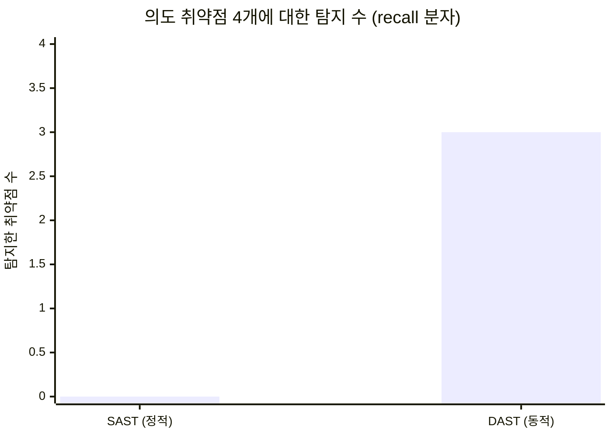
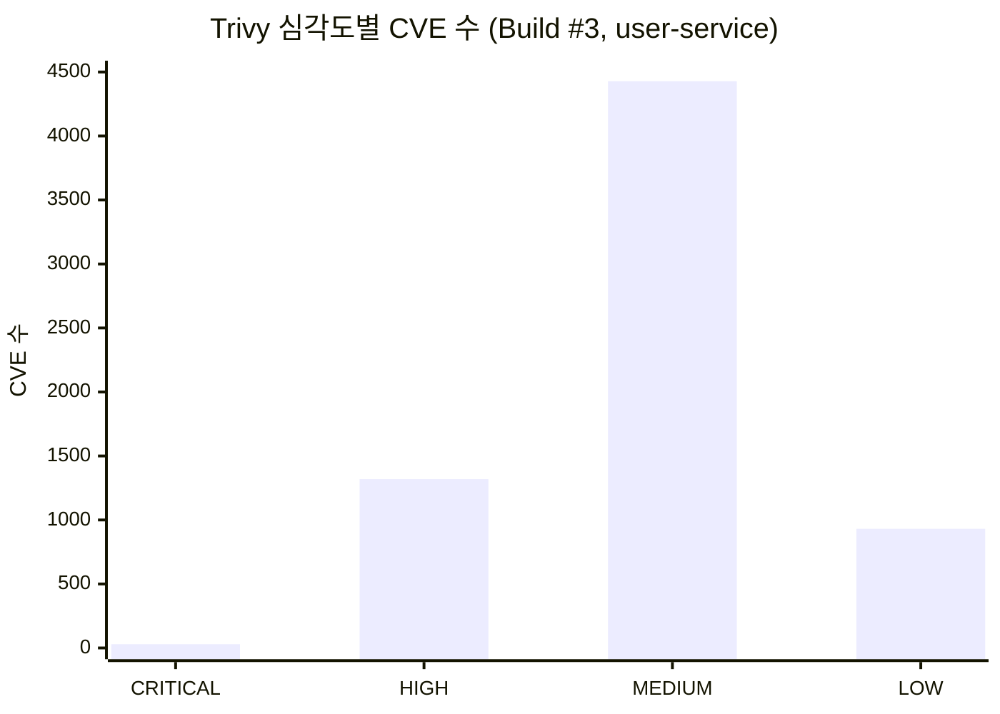

# Detection Efficacy

이 장은 정탐/오탐 분석을 위한 틀이다. 수치를 지어내지 않기 위해, 현재 증적으로 확인된 값과 TODO를 분리한다.

## Tool coverage matrix

| 취약점/위험 클래스 | SonarQube | Gitleaks | Checkov | Kubescape | SBOM | Trivy | DAST | Falco/Cilium |
| --- | --- | --- | --- | --- | --- | --- | --- | --- |
| PHP 코드 취약 패턴 | Primary | - | - | - | - | - | Partial | - |
| Secret leak | - | Primary | - | - | - | - | - | - |
| Dockerfile misconfig | - | - | Primary | Partial | - | Partial | - | - |
| K8s manifest misconfig | - | - | Primary | Primary | - | - | - | - |
| OS/package CVE | - | - | - | - | Inventory | Primary | - | - |
| 신규 CVE 재평가 | - | - | - | - | Primary | Primary | - | - |
| IDOR | Weak | - | - | - | - | - | Primary | Runtime context only |
| Negative transfer | Weak | - | - | - | - | - | Primary | - |
| Webshell upload/RCE | Partial | - | - | - | - | - | Primary | Primary |
| Runtime shell execution | - | - | - | - | - | - | - | Falco |
| Runtime network egress | - | - | - | - | - | - | - | Cilium/Hubble |

## Ground truth

VulnBank MSA에서 명시적으로 재현 대상으로 잡은 ground truth는 4개다.

| ID | 취약점 | 검증 방식 | 현재 증적 |
| --- | --- | --- | --- |
| VULN-1 | 음수 송금 | Custom DAST script | `reports/dev/wsl-poc/evidence/02-negative-transfer.*` |
| VULN-2 | 거래내역 IDOR | Custom DAST script | `reports/dev/wsl-poc/evidence/03-idor-transaction-history.*` |
| VULN-3 | 사용자 정보 변경 IDOR | Custom DAST script | `reports/dev/wsl-poc/evidence/04-idor-user-update.*` |
| VULN-4 | PHP webshell upload/RCE | Custom DAST script | `reports/dev/wsl-poc/evidence/05-*`, `06-*` |

## Current measured CI evidence

AWS CI Build `#3`에서 확인된 정량 값이다.

| 항목 | 값 |
| --- | --- |
| SBOM service count | 6 |
| SPDX package count per service | 170 |
| Kubescape NSA | 14/20 controls passed, 6 failed |
| Kubescape MITRE | 16/17 controls passed, 1 failed |
| Kubescape CIS | 26/33 controls passed, 2 failed |
| Security Gate | BLOCK |
| Blocked service count | 6 |

## 정량 지표 정의 (수식) {#metrics-def}

각 도구의 효능은 단어가 아니라 분류 지표로 표현한다. 분모가 무엇이냐(존재하는 결함 vs 도구가 보고한 것)가 Recall과 Precision을 가른다.

$$
\text{Recall} = \frac{TP}{TP + FN}, \qquad
\text{Precision} = \frac{TP}{TP + FP}, \qquad
\text{FP-rate} = 1 - \text{Precision}
$$

의도된 4개 취약점(ground truth)을 분모로 한 **계층별 Recall** — 동일 워크로드·동일 인프라에서 측정:

$$
\text{Recall}_{\text{SAST}} = \frac{0}{0+4} = 0\%
\qquad\longrightarrow\qquad
\text{Recall}_{\text{DAST}} = \frac{3}{3+1} = 75\%
$$

> SAST가 **0/4**, DAST(verify.sh, AWS 라이브)가 **3/4**(음수송금·IDOR·웹쉘 RCE 실제 실행). 나머지 1개(history IDOR)는 스크립트 미포함 → 케이스 추가 시 4/4 목표.

### 계층별 탐지 효능 (SAST vs DAST)

### Trivy 이미지 CVE 심각도 분포 (user-service)

대부분 `php:7.4`(EOL) 베이스 이미지의 OS 패키지 CVE다 — 앱 코드가 아니라 **단일 근본 원인(베이스 이미지)**이 수천 건을 만든다.

## Per-tool evidence with standard references (OWASP / CWE / CVE)

각 도구가 "제 역할을 한다"는 근거를, 실제 Build `#3` 결과에 표준 분류를 매핑해 정리한다. (현재 증적이 확보된 5종)

| 도구 | 실제 탐지 (Build #3) | CWE | OWASP 2021 | 프레임워크 |
| --- | --- | --- | --- | --- |
| SonarQube (SAST) | `getstatus.php` TLS 인증서/호스트명 검증 비활성 (rule php:S4830 / php:S5527), 약한 해시·난수 | CWE-295, CWE-297, CWE-328, CWE-338 | A02 Cryptographic Failures | — |
| Trivy (SCA/image) | base image CVE 29 CRITICAL / 1319 HIGH (예: curl CVE-2023-38545, glibc CVE-2023-4911) | CWE-787, CWE-1104 | A06 Vulnerable & Outdated Components | NVD / CVE |
| Gitleaks (secrets) | 하드코딩 시크릿 2건 | CWE-798 | A07 Identification & Auth Failures | — |
| Checkov (IaC) | 컨테이너 root 실행 등 Dockerfile 위반(서비스당 2건) + 30 findings | CWE-250, CWE-732 | A05 Security Misconfiguration | CIS Docker |
| Kubescape (K8s) | NSA 14/20, MITRE 16/17, CIS 26/33 미준수 컨트롤 | CWE-250, CWE-269 | A05 Security Misconfiguration | NSA / MITRE ATT&CK / CIS |

### OWASP Top 10 커버리지 (도구 선정 근거)

도구는 임의 선택이 아니라 OWASP Top 10을 레이어별로 분담한다 — 단일 도구로는 A01~A08을 덮지 못한다.

| OWASP 2021 | 담당 |
| --- | --- |
| A01 Broken Access Control | DAST (IDOR) |
| A02 Cryptographic Failures | SAST |
| A03 Injection / A04 Insecure Design | DAST (RCE, 음수 송금) |
| A05 Security Misconfiguration | Checkov, Kubescape |
| A06 Vulnerable & Outdated Components | Trivy, SBOM |
| A07 Identification & Auth Failures | Gitleaks |
| A08 Software & Data Integrity Failures | SBOM (+ 이미지 서명) |
| Runtime behavior | Falco, Cilium (MITRE ATT&CK) |

### SAST 측정 결과 — 계층방어의 정량 근거

의도된 4개 취약점에 대한 SonarQube SAST 탐지:

| 의도 취약점 | SAST 결과 | CWE | OWASP | 판정 |
| --- | --- | --- | --- | --- |
| 음수 송금 (VULN-1) | 미탐 | CWE-840 / CWE-20 | A04 | FN |
| 거래내역 IDOR (VULN-2) | 미탐 | CWE-639 | A01 | FN |
| 회원정보 IDOR (VULN-3) | 미탐 | CWE-639 | A01 | FN |
| 파일업로드 RCE (VULN-4) | 모호한 permission hotspot만 (RCE 특정 못함) | CWE-434 (→ CWE-94) | A04 / A03 | FN |

- **SAST 의도취약점 recall = 0 / 4.** 단 SAST는 A02(암호/TLS)는 정확히 탐지 → "SAST 무용"이 아니라 "담당 레이어가 다름".
- **전체 security_rating = D 인데 Quality Gate는 PASS** — 게이트가 `new_security_rating`(신규 코드)만 평가했기 때문. 기본 게이트 정책의 함정.
- ※ VULN-1·VULN-4는 소스에서 취약 코드 직접 확인(확정 FN), VULN-2·3은 SAST findings에 부재(소스 재확인 TODO).
- → 이 **0/4를 DAST가 3/4로 메운 것**이 계층방어의 정량 근거 — AWS 라이브에서 음수송금·IDOR·웹쉘 RCE를 실제 요청으로 재현(웹쉘은 프론트엔드 게이트웨이 통해 **실행**까지). 위 [수식·차트](#metrics-def) 참고.

## Metrics to complete

아래 값은 아직 evidence 기반 라벨링이 완료되지 않았으므로 TODO로 둔다.

| 지표 | 정의 | 현재 값 |
| --- | --- | --- |
| Recall (SAST) | 의도 취약점 중 SAST 탐지 비율 | **0/4 = 0%** (측정 완료) |
| Recall (DAST) | 의도 취약점 중 DAST 탐지 비율 | **3/4 = 75%** (AWS 라이브, V2 history IDOR만 미시도) |
| Precision | 탐지 결과 중 실제 조치 대상 비율 | 트리아지 후 산정 (Hotspot 45·Checkov 30·Trivy 5,776 라벨링 필요) |
| False negative list | 놓친 취약점 | SAST: V1·V2·V3·V4 전부 / DAST: V2(history IDOR) |
| Accepted risk count | 의도적으로 허용한 finding | 의도 취약점은 보존 대상 → Accepted-Risk로 등록 (Fixed 금지) |
| Runtime (Falco/Cilium) | V4 RCE 런타임 탐지·차단 | 룰 배치됨 → DROPPED/이벤트 증적 수집 TODO |

## Exception workflow

예외 처리는 "무시"가 아니라 근거 있는 상태 전환이어야 한다.

| 상태 | 의미 | 필요한 근거 |
| --- | --- | --- |
| False Positive | 도구가 잘못 탐지 | 재현 불가, 코드 경로 없음, scanner rule 근거 |
| Accepted Risk | 실제 위험이나 일정 기간 수용 | 영향도, 보완통제, 만료일 |
| VEX Not Affected | 구성요소는 있으나 취약 코드 경로가 아님 | SBOM component, call path 분석 |
| Fixed | 수정 완료 | 새 build tag, scan 재실행 결과 |

## Why multiple layers are needed

SAST는 비즈니스 로직 취약점에 약하고, DAST는 코드 경로와 원인을 설명하기 어렵다. SCA는 package CVE에 강하지만 IDOR 같은 권한 검증 결함을 직접 증명하지 못한다. Runtime detection은 공격 행위의 증거를 주지만 배포 전 차단에는 늦다.

따라서 이 PoC는 하나의 도구 점수가 아니라 `source → build → image → deploy → runtime → evidence` 전체 흐름의 판단 근거를 쌓는 구조다.
