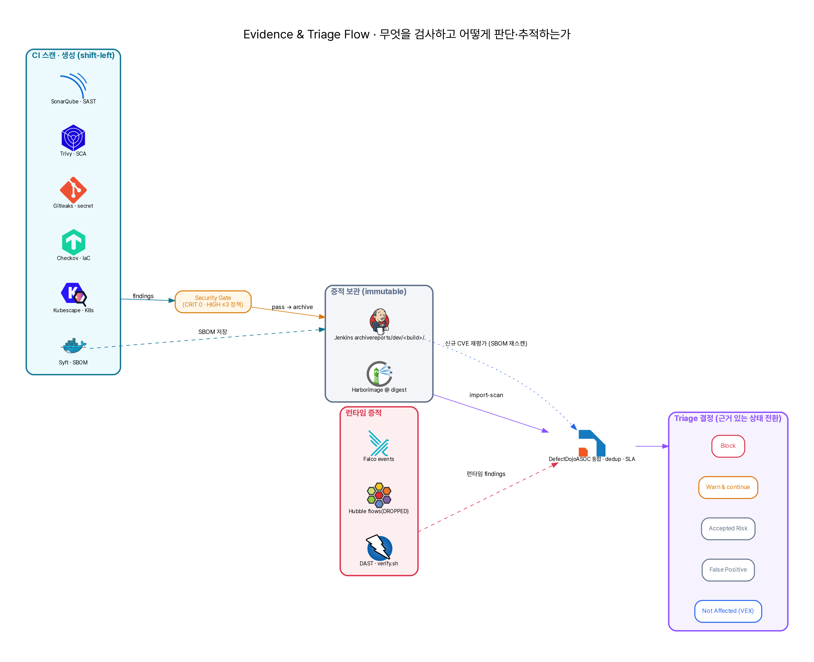

# Evidence & Triage

Evidence의 목적은 "빌드가 성공했다"가 아니라 "무엇을 검사했고, 어떤 기준으로 허용/차단했으며, 나중에 다시 추적할 수 있는가"를 남기는 것이다.

## Evidence chain

{ loading=lazy }

> CI 스캔·생성 → Security Gate → 증적 보관(Jenkins archive + Harbor digest) → DefectDojo 통합 → Triage 결정. 런타임 증적(Falco·Hubble·DAST)과 SBOM 기반 신규 CVE 재평가가 측면 입력으로 합류한다. `diagram/evidence.py`(diagram-as-code)로 생성되어 재현 가능하다.

## CI evidence artifacts

AWS CI Build `#3`에서 archive된 구조는 다음과 같다.

| Directory | 의미 |
| --- | --- |
| `metadata.txt` | build number, repo SHA, image tag, registry project |
| `gitleaks/` | secret scan 결과 |
| `sonarqube/` | scanner workdir와 SAST 결과 |
| `checkov/` | Dockerfile, Helm/K8s IaC scan 결과 |
| `kubescape/` | NSA/MITRE/CIS K8s framework 결과 |
| `sbom/` | SPDX/CycloneDX SBOM |
| `trivy/` | image vulnerability scan |
| `gate/` | security gate summary |
| `registry/` | image push log |
| `ci-evidence-summary.txt` | evidence directory map |
| `evidence-files.txt` | archive file list |

## Runtime evidence artifacts

Local/Wsl PoC 기준 runtime evidence는 다음 형태로 남는다.

| File | 의미 |
| --- | --- |
| `01-login.*` | token login 요청/응답 |
| `02-negative-transfer.*` | 음수 송금 재현 |
| `03-idor-transaction-history.*` | 거래내역 IDOR 재현 |
| `04-idor-user-update.*` | 사용자 정보 수정 IDOR 재현 |
| `05-webshell-upload.*` | 웹셸 업로드 |
| `06-webshell-exec.*` | 웹셸 실행 marker |
| `msa-vulnerability-evidence.json` | vulnerability evidence JSON |
| `summary.txt` | PASS/FAIL summary |

## SBOM usage

SBOM은 단순 첨부물이 아니라 신규 CVE 대응의 인덱스다.

운영 시나리오:

1. 신규 CVE 공개
2. 취약 package 이름과 version range 확인
3. Jenkins archive 또는 SBOM 저장소에서 과거 image tag 검색
4. 영향받는 build number와 service 식별
5. fixed version 존재 여부 확인
6. rebuild, accepted risk, VEX not affected 중 결정
7. 결정과 근거를 triage system에 기록

현재 상태:

- SPDX와 CycloneDX 생성 완료
- Dependency tracking 시스템 자동 연동은 TODO

## DefectDojo role

DefectDojo는 로그 저장소가 아니라 findings lifecycle 관리 도구다.

| 기능 | 필요한 이유 |
| --- | --- |
| Product/Engagement | 워크로드별 findings 구분 |
| Import scan | Trivy, Gitleaks, Checkov, SonarQube 등 결과 통합 |
| Deduplication | 반복 finding 관리 |
| Triage state | false positive, accepted risk, fixed 구분 |
| SLA | Critical/High 조치 기한 관리 |

현재 상태:

- 전용 VM 가동 + Gitleaks / Trivy / Checkov / CycloneDX(SBOM) import 동작 (별도 Jenkins job)
- 메인 파이프라인으로의 import stage 통합, SonarQube API import는 진행 중

## Triage decision model

| 판단 | 예시 |
| --- | --- |
| Block | fixed version이 있는 Critical CVE, 실서비스 노출 secret, 위험한 K8s 권한 |
| Warn and continue | 실습용 취약 workload, 보완통제 존재, 낮은 영향도 |
| Accepted risk | 운영 영향도와 만료일을 명시하고 임시 수용 |
| False positive | 재현 불가 또는 scanner rule 한계 |
| Not affected | SBOM에는 있으나 실행 경로가 없음 |

## AI triage placeholder

AI triage는 findings를 자동으로 닫는 기능이 아니라, 사람이 판단할 수 있게 evidence를 요약하고 연결하는 보조 역할이어야 한다.

현재 TODO:

- scanner output 요약
- service별 위험도 묶기
- SBOM component와 CVE 연결
- accepted risk 근거 초안 생성
- DefectDojo ticket/comment 초안 생성
