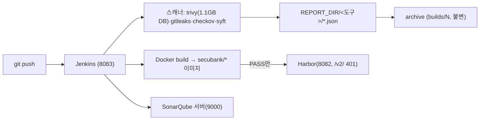

# 실습 가이드 · CI 파이프라인 하나하나 보기

<div class="sb-lede" markdown>
"설치했다"가 아니라 *직접 들어가서 까보며* 배우는 실습 런북이다. 명령을 한 줄씩 치고, 각 토막이 무슨 뜻인지, 출력에서 무엇을 볼지 확인한다. (참조용 접속/연동은 <a href="operator-runbook/">운영자 런북</a>, 이건 학습용.)
</div>

대상: CI 노드 `i-01011276c12b34d2c`(10.0.1.169). 전부 SSM으로 접속한다.

## 0. CI VM에 들어가기

```bash
aws ssm start-session --target i-01011276c12b34d2c --profile secubank --region ap-northeast-2
sudo -i      # root로 — Jenkins 파일·docker 소켓이 root 권한이라 필요
```

## 1. Jenkins — 어떻게 도나 (설정 → 프로세스 추적)

```bash
systemctl status jenkins --no-pager | head -8
```
`systemctl`은 systemd(리눅스 서비스 관리자)에게 묻는 명령. (인자 없이 `systemctl`만 치면 198개 유닛이 전부 쏟아진다 — 그래서 `status jenkins`로 *하나만* 좁힌다.) 출력 한 줄씩:

| 줄 | 뜻 |
| --- | --- |
| `●` + 설명 | 초록 점 = 건강하게 가동 |
| `Loaded: …; enabled;` | 유닛 위치 + **enabled = 부팅 시 자동 시작** |
| `Drop-In: …/jenkins.service.d/override.conf` | ★ 원본을 안 건드리고 *덮어쓰는* 설정. 포트·Java가 여기 산다 |
| `Active: active (running) since …` | 가동 시작 시각 |
| `Main PID: … (java)` | **프로세스가 java** — Jenkins는 JVM 위 java 프로세스(jenkins.war) |

커스터마이즈가 사는 Drop-In을 직접 보면:
```bash
cat /etc/systemd/system/jenkins.service.d/override.conf
#  Environment="JENKINS_PORT=8083"                       ← 기본 8080을 8083으로
#  Environment="JAVA_HOME=/usr/lib/jvm/java-21-amazon-corretto"  ← Java 21 강제(17이면 안 뜸)
```

그 설정이 *실제 프로세스에 반영됐는지* 확인:
```bash
ps -ef | grep "jenkins.war" | grep -v grep
#  jenkins  219269  1  …  java-21-…/bin/java -Djava.awt.headless=true
#           -jar /usr/share/java/jenkins.war --webroot=/var/cache/jenkins/war --httpPort=8083
```
- 맨 앞 **`jenkins`** = 실행 사용자(root 아님 — 최소권한. 단 docker 그룹이라 빌드는 가능).
- `PPID=1` = systemd가 부모(관리되는 서비스). `?` = TTY 없는 데몬.
- `java-21-…/bin/java … --httpPort=8083` = **override의 JENKINS_PORT=8083·JAVA_HOME이 그대로 흘러왔다.**

> 핵심: `override.conf의 JENKINS_PORT=8083` → systemd → `java … --httpPort=8083`. *설정 한 줄이 떠 있는 포트로 이어지는 사슬*을 직접 따라간 것. 이게 "그냥 깔았다"와 "어떻게 도는지 안다"의 차이다.

## 2. Jenkins가 뭘 하나 — 잡과 빌드

```bash
ls -1 /var/lib/jenkins/jobs/
#  secubank-runtime-security
#  secubank-sast-defectdojo-test   ← DefectDojo 연동 잡
#  vulnbank-msa-ci                 ← 메인 파이프라인
```
`/var/lib/jenkins`가 Jenkins의 집(JENKINS_HOME). *잡 = 디렉터리 하나*.

```bash
ls /var/lib/jenkins/jobs/vulnbank-msa-ci/builds/      # 1  2  3  permalinks
grep -E "Pipeline\] \{ \(|Finished:" /var/lib/jenkins/jobs/vulnbank-msa-ci/builds/3/log
```
- 빌드는 번호별 디렉터리(`builds/3/`)로 남고, `log`가 그 빌드의 *콘솔 출력*이다.
- 로그는 단계마다 `[Pipeline] { (스테이지)` 를 찍는다. grep으로 그 *관문 목록*만 뽑는다. (줄 앞의 `ha:////…` 는 Jenkins가 UI용으로 심는 base64 콘솔 주석 — 무시.)

빌드 #3이 실제로 거친 **18단계**(로그 실측):

```text
1 Checkout SCM · 2 Checkout · 3 Preflight Tools · 4 Checkout App Source · 5 Checkout GitOps Repo · 6 Prepare Metadata
7 Gitleaks Secret Scan · 8 SonarQube SAST · 9 Checkov IaC Scan · 10 Kubescape K8s Manifest Scan
11 Docker Build Services · 12 Generate SBOM · 13 Trivy Scan Services · 14 Security Gate
15 Registry Login · 16 Registry Push Services · 17 Collect CI Evidence · 18 Archive Evidence
→ Finished: SUCCESS
```

- **볼 것**: 실제 돌아간 건 **7개 도구 전부**(Gitleaks·SonarQube·Checkov·Kubescape·SBOM·Trivy + 게이트)를 거치는 18-stage다. 빌드 전(시크릿·SAST·IaC·K8s) → 빌드·SBOM·이미지CVE → 게이트 → 레지스트리 → 증적 순서가 로그에 그대로 찍혀 있다.

## 3. 빌드 엔진 — Docker

```bash
docker version --format 'server {{.Server.Version}}'
docker images | grep secubank | head
```
- 이미지 빌드는 *호스트 Docker 데몬*이 한다(Jenkins가 docker 그룹).
- **볼 것**: `10.0.1.169:8082/secubank/vulnbank-msa-*` 태그가 붙은 *우리가 빌드한* 이미지들. 태그 `10.0.1.169:8082`가 곧 "Harbor로 보낼 주소"다.

## 4. Harbor — OCI 레지스트리

```bash
docker ps --format '{{.Names}}\t{{.Status}}' | grep -i harbor
curl -s -o /dev/null -w 'GET /v2/ -> %{http_code}\n' http://localhost:8082/v2/
```
- `curl` 토막: `-s` 조용히, `-o /dev/null` 본문 버림, `-w '%{http_code}'` HTTP 코드만 출력. `/v2/`는 OCI Distribution API 루트.
- **볼 것**: Harbor는 컨테이너 *8개 스택*(core·registry·db·nginx·portal·jobservice·registryctl·log). 그리고 `/v2/ -> 401` — **익명 거부(인증 필요)**. 레지스트리가 열려 있지 않다는 증거.

## 5. 스캐너 — 무엇으로 판단하나

```bash
trivy --version; gitleaks version; checkov --version; syft version
ls -lh /var/lib/jenkins/.cache/trivy/db/trivy.db
```
- **볼 것**: `trivy.db`가 **약 1.1GB** — 이게 *등재된 CVE 데이터베이스*다. Trivy는 이미지 패키지를 이 DB와 대조한다. 그래서 *DB에 없는 0-day는 못 잡는다*(구조적 한계).

직접 한 번 돌려보기(공개 이미지라 인증 불필요):
```bash
trivy image --severity CRITICAL,HIGH alpine:3.12 | head -25
```
- `trivy image <이미지>` = 그 이미지를 풀어 패키지 목록을 뽑고 DB와 대조. `--severity`로 등급 필터.
- **볼 것**: 오래된 alpine이라 CVE가 줄줄 뜬다. "패키지 → 설치버전 → 취약버전 → 수정버전" 형식 = Trivy가 *매칭*하는 방식.

## 6. SonarQube — 서버형 SAST

```bash
docker ps --format '{{.Names}} {{.Status}}' | grep -i sonar
curl -s http://localhost:9000/api/system/status
```
- **볼 것**: SonarQube는 CLI가 아니라 *컨테이너로 뜬 서버*(`{"status":"UP"}`). 스캐너가 결과를 *서버에 올리고* Quality Gate를 *되묻는다*. 그래서 SonarQube만 결과가 파일이 아니라 서버에 산다.

## 7. 증적 — 워크스페이스에서 archive로

```bash
ls /var/lib/jenkins/workspace/vulnbank-msa-ci/reports/dev/3/
ls /var/lib/jenkins/jobs/vulnbank-msa-ci/builds/3/archive/reports/dev/3/gate/
cat /var/lib/jenkins/jobs/vulnbank-msa-ci/builds/3/archive/reports/dev/3/gate/msa-gate-summary.txt
```
- **볼 것**: 같은 빌드 #3의 증적이 *워크스페이스*(휘발 — 다음 빌드에 덮어씀)와 *archive*(불변 — 빌드번호별 영구 보존) 두 군데에 있다. `msa-gate-summary.txt`엔 게이트 임계값·판정·사유가 박혀 있다 — "왜 통과/차단했나"의 증적.

---

## 한 장 흐름



> 다음 실습: 런타임(k3s·Cilium·Falco)도 같은 방식으로 하나하나 — 별도 면으로 잇는다.
