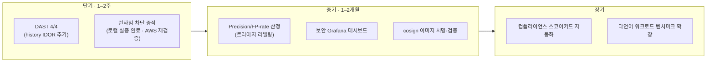

# 한계 및 향후 과제

이 PoC의 핵심 원칙은 "수치를 지어내지 않는다"이다. 따라서 **무엇이 측정·구현됐고 무엇이 아직 아닌지**를 명시한다. 아래 한계는 결함이 아니라 *다음 측정 대상*이다 — 증적이 쌓이는 대로 갱신한다.

> **2026-06 갱신 · 로컬 라이브 실증:** AWS 환경이 내려가 있는 동안(비용 0 유지), admission 강제 · 네트워크 봉쇄 · 런타임 탐지의 *메커니즘*을 로컬 kind 클러스터에서 반증 가능하게 검증했다([Runtime Security · 라이브 실증](runtime-security.md) 참조). 아래 표의 일부 항목은 그 결과를 반영해 갱신됐다 — **단 이는 로컬 메커니즘 실증이지 프로덕션/AWS 규모의 증명이 아니며, CI 게이트는 여전히 관측 모드다.**

---

## 1. 측정의 한계 (Measurement)

| 항목 | 현재 | 한계 | 다음 단계 |
| --- | --- | --- | --- |
| **DAST recall** | 3/4 (75%) — 음수송금·IDOR·웹쉘 RCE 실제 실행 | V2(거래내역 IDOR) 케이스가 `verify.sh`에 미포함 | 케이스 추가 → **4/4** 목표 |
| **Precision / FP-rate** | 미산정 | 트리아지 라벨링 전이라 분모 확정 불가 | Hotspot 45 · Checkov 30 · Trivy 5,776 라벨링 후 산정 |
| **런타임 차단 증적** | **로컬 kind에서 라이브 실증** — Cilium egress DROP(Hubble) + Falco 탐지(T1555/T1059) + 풀 웹쉘 체인 캡처 | 로컬 kind 검증(프로덕션·AWS 규모 아님) | AWS 복구 후 동일 재검증 + 시나리오 확대 |
| **시계열** | 단일 빌드(#3) 스냅샷 | 반복·추세 미측정 | 빌드별 지표 누적(회귀 추적) |

> 측정 지표 정의(Recall/Precision 수식)와 현재 값은 [탐지 효능](detection-efficacy.md#metrics-def)에 있다.

---

## 2. 운영·인프라의 한계 (Operations)

| 항목 | 현재 | 한계 | 다음 단계 |
| --- | --- | --- | --- |
| **가용성** | 단일 리전(ap-northeast-2) · 단일 노드 k3s | HA·다중 AZ 아님 (데모 목적) | 멀티 노드 / 매니지드 k8s 옵션 |
| **시크릿 관리** | 일부 환경변수 기반 | Parameter Store / Vault 미연동 | 시크릿 외부화 + 회전 |
| **이미지 서명** | **검증 메커니즘 로컬 실증** — Kyverno+Cosign verifyImages Enforce가 미서명 이미지를 admission에서 거부 | *우리 이미지*의 CI `cosign sign`·SLSA는 미구현(검증만 실증) | CI 서명 스테이지 + SLSA attestation |
| **SMS 알림** | email(SNS) 운영 | SMS는 ap-northeast-2 미지원(Tokyo 샌드박스 필요) | 필요 시 Tokyo 번호 검증 또는 Slack/PagerDuty |

---

## 3. 관측의 한계 (Observability)

| 항목 | 현재 | 한계 | 다음 단계 |
| --- | --- | --- | --- |
| **메트릭** | Prometheus + Falco 메트릭 scrape(타깃 up) | 보안 전용 Grafana 대시보드 미완 | 탐지·차단 KPI 대시보드 |
| **L7 가시성** | Cilium/Hubble 동작 | Hubble flow 메트릭 미연동 | L7 egress/네트워크 정책 위반 시각화 |

---

## 4. 범위의 한계 (Scope)

| 항목 | 현재 | 한계 | 다음 단계 |
| --- | --- | --- | --- |
| **검증 워크로드** | VulnBank MSA(앱) + TerraGoat/KubeGoat(인프라) | 언어·프레임워크 다양성 부족 | 다언어 워크로드로 도구 커버리지 확장 |
| **컴플라이언스 매핑** | ISMS-P 중심 | PCI-DSS/SOC2/NIST는 분석 단계 | 실측 기반 스코어카드 자동화 |

---

## 5. 향후 로드맵 (우선순위)

| 우선순위 | 과제 | 근거 |
| --- | --- | --- |
| **P1 (단기)** | DAST 4/4 · 런타임 차단 증적(로컬 실증 완료 → AWS 재검증) | 계층방어 정량 근거 — 런타임 빈칸은 로컬 kind로 채움 |
| **P2 (중기)** | Precision 산정, 보안 대시보드, 이미지 서명 | "탐지"에서 "운영 가능한 탐지"로 |
| **P3 (장기)** | 컴플라이언스 자동화, 워크로드 확장 | 골든패스의 일반화(워크로드 무관) 입증 |

---

## 왜 한계를 공개하는가

평가 도구(scorer)는 "통과/실패"만 남기고 미측정 영역을 숨긴다. 이 골든패스는 반대로 **측정된 것과 아직 아닌 것의 경계를 증적으로 드러낸다.** 그 경계가 곧 다음 작업 목록이고, 재현하는 사람이 같은 자리에서 이어받을 수 있다는 것이 이 프로젝트의 [가치](adoption.md#value)다.
