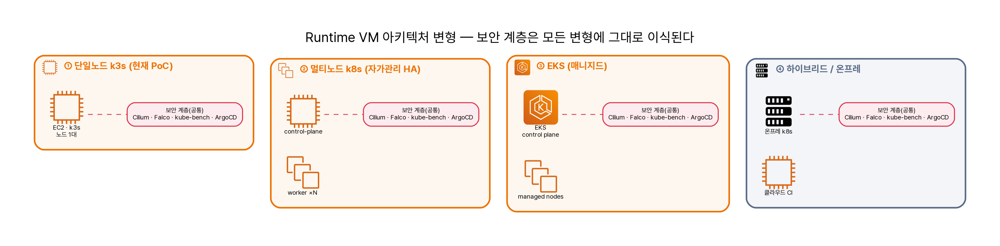

# 도입 시나리오 — 새 워크로드를 골든패스에 태우기

<div class="sb-lede" markdown>
한 핀테크가 새 결제 API 레포를 만들었다고 하자. 이 골든패스를 어떻게 자기 것으로 만들까? 핵심은 **"파이프라인을 새로 짜는 게 아니라, 가리키는 곳만 바꾼다"** 이다. 새 GitHub 레포 → CI 연결 → 결과물 적재 → CD(GitOps) → 워크로드별 차이 → 보안도구 선택 → 런타임 보안의 실효성까지, 도입의 전 과정을 따라간다.
</div>

## 1. 유스케이스

핀테크 **PayCorp**가 결제 API 레포 `payment-api`(서비스 3개: auth · ledger · gateway)를 새로 만들었다. 보안팀은 매 배포의 "내보내도 되나" 판단을 사람 손이 아니라 파이프라인으로 옮기고 싶다. 골든패스(`devsecops-path`)를 그대로 가져와 *자사 레포에 연결*하는 것이 목표다.

## 2. CI 온보딩 — 어디를 수정하나

가장 중요한 사실 먼저: **`Jenkinsfile.aws-ci`는 한 줄도 고치지 않는다.** 18단계 파이프라인은 전부 **파라미터화**돼 있어서, Jenkins Job의 파라미터만 자사 값으로 바꾼다.

| 파라미터 | 의미 | 기본(PoC) | PayCorp 도입 시 |
| --- | --- | --- | --- |
| `APP_SOURCE_REPO_URL` | 워크로드 소스 레포 | `app-source-repo` | `github.com/paycorp/payment-api` |
| `MSA_WORKLOAD_DIR` | 체크아웃 후 워크로드 루트 | `…/examples/vulnbank-msa` | `payment-api/services` |
| `SERVICES` | 빌드·스캔 대상 목록 | `user-service,…,frontend` | `auth,ledger,gateway` |
| `HELM_CHART_DIR` | Checkov/Kubescape 대상 차트 | `…/helm/vulnbank-msa` | `…/helm/payment-api` |
| `GITOPS_REPO_URL` | 매니페스트(CD) 레포 | `gitops-manifest-repo` | `github.com/paycorp/payment-gitops` |
| `REGISTRY_URL` · `REGISTRY_PROJECT` | Harbor 엔드포인트·네임스페이스 | `…:8082` / `secubank` | 자사 Harbor / `paycorp` |
| `SONAR_TOKEN` | SonarQube 토큰(비우면 SAST 스킵) | Jenkins credential | 자사 토큰 |
| `ENFORCE_GATE` | 게이트 차단 여부 | `false`(report-only) | 단계적으로 `true` |

새 레포가 갖춰야 할 **최소 계약**(이게 있어야 파이프라인이 탄다): `Dockerfile`, Helm 차트(또는 매니페스트), `/healthz` 프로브, *(선택)* OpenAPI 스펙. 상세는 [코드·설정 맵](code-map.md)과 [도입 가이드](adoption.md)에.

<div class="sb-key" markdown>
**골든패스의 의미가 여기 있다.** 새 워크로드 도입 = *파이프라인 교체*가 아니라 *파라미터 교체 + 최소 계약 충족*. 파이프라인 로직(스캐너·게이트·증적)은 워크로드와 무관하게 그대로 재사용된다.
</div>

## 3. CI 결과물 — 어디에 쌓이고 어떻게 설정하나

빌드마다 `reports/dev/<BUILD_NUMBER>/` 아래에 도구별 산출물이 누적된다(실측: Build #2 산출물이 `…/workspace/vulnbank-msa-ci/reports/dev/2/`에 실제로 쌓여 있었고, 그 SBOM을 재스캔해 2026 신규 CVE를 찾았다).

| 경로 | 내용 |
| --- | --- |
| `metadata.txt` | repo SHA · 서비스 목록 · 게이트 설정 |
| `gitleaks/` | 시크릿 스캔 |
| `sonarqube/` | SAST |
| `checkov/` · `kubescape/` | IaC · K8s(NSA/MITRE/CIS) |
| `sbom/` | SPDX + CycloneDX (서비스별) |
| `trivy/` | 이미지 CVE |
| `gate/` | 게이트 판정 |
| `ci-evidence-summary.txt` | 전체 요약 |

여기에 더해 ① **Harbor**에 `<REGISTRY_URL>/<PROJECT>/<service>:<tag>` 이미지가 push되고, ② Jenkins **Archive Evidence** 단계가 위 리포트를 아티팩트로 영구 보관한다. ③ *(선택)* **DefectDojo** 중앙 triage — `reports/`를 import-scan으로 보내 finding lifecycle·SLA를 관리(현재는 수동/스크립트, 자동화는 도입사가 붙인다).

## 4. CI → CD — YAML이 어떻게 생성·갱신되나

CI는 **Harbor에 이미지 push까지**다. CD의 트리거는 **GitOps 레포의 이미지 태그 갱신**이다.

```
CI 통과 → 이미지 :<BUILD_NUMBER> push → gitops values의 image.tag 갱신 → ArgoCD가 감지 → k3s에 sync
```

GitOps Helm values에서 갱신되는 지점:
```yaml
services:
  gateway:
    image:
      repository: <harbor>/paycorp/gateway
      tag: "42"      # ← CI BUILD_NUMBER 로 갱신되는 한 줄
```

<div class="sb-key" markdown>
**정직하게**: 현재 `Jenkinsfile.aws-ci`는 이미지 push까지만 하고, **gitops 태그를 자동 커밋하는 스테이지는 없다**. 도입사는 둘 중 하나를 붙인다 — (a) CI에 *gitops update* 스테이지 추가(`yq`로 태그 교체 후 gitops repo에 `git commit`/push), 또는 (b) **Argo CD Image Updater**가 Harbor를 watch해 자동 갱신. 어느 쪽이든 나머지는 ArgoCD의 `automated` sync(selfHeal)가 한다. *(실측: falco 앱이 auto-sync라, gitops에 push하니 ConfigMap이 즉시 반영됐다.)*
</div>

## 5. 워크로드 종류별 차이

파이프라인·게이트·런타임 통제는 **언어 무관**이다. 달라지는 건 SAST 룰셋과 SCA가 보는 패키지 생태계뿐.

| 워크로드 | 빌드 | SAST | SCA / SBOM | DAST 표면 | 특이점 |
| --- | --- | --- | --- | --- | --- |
| PHP (VulnBank) | php Dockerfile | SonarQube PHP | Trivy(OS+composer) · Syft | HTTP/OpenAPI | EOL 베이스이미지 CVE 다수 |
| Node | node Dockerfile | SonarQube JS/TS | npm SBOM · advisory | REST/GraphQL | **공급망(npm) 핵심** — axios류 |
| Java | maven/gradle | SonarQube Java | maven/gradle SBOM | REST | 깊은 의존성 트리 |
| Go | multi-stage | SonarQube Go / gosec | go.mod SBOM | gRPC/REST | distroless 베이스 → CVE 표면↓ |
| Python | pip Dockerfile | SonarQube Py / bandit | pip SBOM | REST | 네이티브 의존성 빌드 |

SBOM 포맷(SPDX/CycloneDX)·Trivy·게이트·Falco/Cilium은 그대로 적용된다 — **워크로드는 최소 계약만 맞추면 된다.**

## 6. 다양한 Runtime VM 아키텍처

런타임은 한 가지가 아니다. 규모·HA·운영부담·규제에 따라 네 가지로 갈린다. 어느 변형이든 **Cilium·Falco·kube-bench·ArgoCD 계층은 그대로 이식**된다(런타임 보안은 클러스터 형태와 무관).

| 변형 | 구성 | 적합 | 트레이드오프 |
| --- | --- | --- | --- |
| ① 단일노드 k3s *(현재 PoC)* | EC2 1대 + k3s | PoC · 교육 · 소규모 | HA 없음 — 노드 다운 시 전체 정지 |
| ② 멀티노드 k3s/k8s(자가관리) | EC2 3+대, control-plane HA | 중규모 · 비용통제 | 운영부담(업그레이드·etcd 백업) |
| ③ EKS(매니지드) | EKS + managed node group | 규모 · 운영 위임 | 비용↑, 컨트롤플레인은 AWS가 |
| ④ 하이브리드 / 온프레 | 온프레 k8s + 클라우드 CI | 규제 · 데이터 거주성 | 네트워크·이미지 동기화 설계 |

{ loading=lazy }

> 어느 변형이든 **보안 계층(Cilium·Falco·kube-bench·ArgoCD)은 그대로 이식**된다 — 런타임 보안은 클러스터 형태(k3s·k8s·EKS·온프레)와 무관하게 동작한다. AWS 공식 아이콘 기반이며 `diagram/runtime-variants.py`로 재현 가능하다.

## 7. 보안 도구 선택 — 조직 유형·목표별

도구는 전부 켜는 게 아니라 **조직의 목표에 맞춰 강조점**을 둔다.

| 조직 / 목표 | 강조 도구 | 이유 |
| --- | --- | --- |
| 금융 · 규제(컴플라이언스) | Kubescape(CIS/NSA) · DefectDojo · 이미지 서명(Cosign) · kube-bench | 감사·증적·규제 매핑이 1순위 |
| 스타트업 · 속도(shift-left 최소) | Trivy · Gitleaks · Gate(report-only) | 빠른 피드백, 개발 마찰 최소화 |
| 공급망 리스크 중심 | SBOM 재평가 · Trivy · Cosign/Kyverno · **Cilium egress** | 신뢰 의존성 무기화·C2 차단 |
| 멀티테넌시 · 런타임 위협 | Cilium(L7 정책) · Falco · Hubble | 측면이동·런타임 행위 탐지 |

원칙은 공통이다 — **report-only로 시작해 노이즈를 줄인 뒤 단계적으로 enforce.** (→ [도입 가이드의 단계 로드맵](adoption.md))

## 8. Runtime VM의 실효성·효과

빌드 검사를 통과한 악성도 런타임에서 막힌다 — 그게 런타임 보안의 존재 이유다. 이번에 **AWS 라이브로 실증**했다([증적](reproduce.md)):

- 정적분석(SAST)은 의도 취약점 **0/4**, 동적분석(DAST) **3/4** — 그래도 통과한 페이로드를 런타임이 잡는다.
- **Falco**: 웹쉘 업로드·셸 spawn 실제 발화(`proc=php target=…/uploads/…webshell.php`).
- **Cilium egress**: 외부 C2(`1.1.1.1`) 연결이 `Policy denied DROPPED` — 악성이 배포돼도 *밖으로 못 나간다*.

<div class="sb-key" markdown>
런타임 보안이 없으면, 0-day 악성 의존성이 모든 빌드 검사를 통과하는 순간 무방비다. **런타임 egress 차단·행위 탐지가 그 마지막 갭을 메운다** — 빌드(SCA known) + 시간축(SBOM 재평가) + 런타임(Falco/Cilium)의 3겹 중, 런타임 VM이 *배포 이후*를 책임진다. 이건 이론이 아니라 위 증적으로 입증됐다.
</div>

## 더 읽기

- 도입 가치 · 온프레/하이브리드 → [도입 가이드](adoption.md)
- 파이프라인 단계 → 파일 위치 → [코드·설정 맵](code-map.md)
- 런타임 보안 상세 → [런타임 보안](runtime-security.md)
- 증적 직접 재현 → [재현 런북](reproduce.md)
