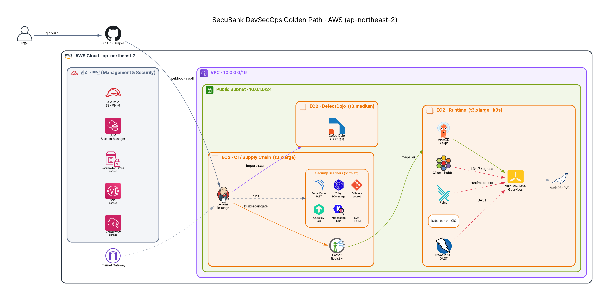

# 보안담당자 실무를 재현한 DevSecOps Golden Path

## 들어가며

금융권 서비스는 **빠른 배포**와 **강한 보안·규제 준수**를 동시에 요구받는다. 매 배포마다 보안담당자는 "이 코드를 내보내도 되는가?"를 판단하고, 막거나 허용한 근거를 **증적**으로 남겨야 한다. 최근 axios(npm), xz-utils(CVE-2024-3094) 같은 **공급망 공격**이 이어지면서, "한 번 검사하고 끝"이 아니라 **지속적인 재평가**의 중요성이 커졌다.

이 글은 의도적으로 취약하게 만든 뱅킹 애플리케이션(**VulnBank MSA**, 6개 마이크로서비스)을 대상으로, 보안담당자의 실무 — **판단·차단·추적·재평가·증적** — 를 Kubernetes 파이프라인으로 재현한 PoC를 소개한다. 핵심 메시지는 하나다: **"도구를 많이 붙였다"가 아니라, 각 도구가 어떤 위협을 어떻게 막는지 데이터로 증명한다.**

## 해결하려는 문제

!!! question "이 PoC가 답하려는 질문"

1. **도구를 많이 붙이면 안전한가?** — 단일 도구에는 사각이 있다. SAST는 코드 패턴(약한 암호·TLS 검증 누락)은 잘 잡지만, **비즈니스 로직·인가(IDOR) 결함은 보지 못한다.**
2. **배포 시점 1회 검사로 충분한가?** — 오늘 통과한 빌드가 내일 새 CVE로 위험해진다. 재평가 체계가 없으면 이미 배포된 이미지는 방치된다.
3. **판단·차단·증적이 흩어져 있지 않은가?** — 어떤 도구가 무엇을 막았고 왜 허용했는지가 사람의 기억과 산발적 리포트에 흩어지면 **감사·추적이 불가능**하다.

## 전체 아키텍처

{ loading=lazy }

> 위 다이어그램은 diagram-as-code로 생성한 버전이며, AWS 공식 아이콘 스타일 버전을 별도 정리 중이다.

**골든패스 흐름**: 개발자가 GitHub에 push → **Jenkins CI**가 다중 repo를 checkout하고 18단계 보안 검사 수행 → 통과 이미지를 **Harbor**에 push → **GitOps repo** 갱신 → **ArgoCD**가 runtime **k3s**에 배포 → **Cilium/Falco**가 런타임 행위를 관측·차단 → 모든 스캔 결과는 **DefectDojo**로 모여 triage된다. (3-VM: CI / runtime k3s / DefectDojo)

## 핵심 기능 및 기술 구현

### 1. Shift-left CI 파이프라인 (18-stage)

**무엇** — Jenkins 선언형 파이프라인(`Jenkinsfile.aws-ci`)이 18개 stage로 구성된다.
**왜** — 비싼 빌드 전에 싸고 빠른 소스 검사를 먼저 돌려 **일찍 차단(shift-left)**하기 위해.
**어떻게** — 빌드 *전*: Gitleaks(시크릿) → SonarQube(SAST) → Checkov(IaC) → Kubescape(K8s). 빌드 *후*: Syft(SBOM) → Trivy(이미지 CVE) → Security Gate → Harbor push.
**효과** — 6개 서비스 빌드+스캔+push가 한 흐름에서 동작(Build #3 SUCCESS), 모든 결과를 증적으로 아카이브.

### 2. 계층방어 — OWASP Top 10을 레이어별로 분담

**무엇** — 도구를 OWASP Top 10 카테고리에 매핑해 사각을 메운다.

| OWASP 2021 | 담당 도구 | 실제 탐지 (Build #3) |
| --- | --- | --- |
| A02 Cryptographic Failures | SonarQube(SAST) | TLS 인증서/호스트명 검증 비활성 (CWE-295/297) |
| A06 Vulnerable Components | Trivy(SCA) | base image 29 CRITICAL / 1319 HIGH (CVE-2023-38545 등) |
| A07 Auth/Secrets | Gitleaks | 하드코딩 시크릿 (CWE-798) |
| A05 Security Misconfig | Checkov / Kubescape | 컨테이너 root 실행, NSA 14/20·CIS 26/33 |
| A01 Broken Access Control | DAST | IDOR (CWE-639) |
| A04 Insecure Design | DAST | 음수 송금·파일업로드 RCE (CWE-840/434) |

**왜 / 효과** — **SAST의 의도 취약점 recall은 0/4였다.** 음수 송금·IDOR·RCE 같은 로직/인가 결함은 정적분석의 사각이기 때문이다. 이 0/4를 **DAST가 메우는 것**이 계층방어의 정량적 근거다. *단일 도구로는 A01~A08을 덮을 수 없다.*

### 3. Security Gate — "판단"을 코드화

**무엇** — 모든 스캔 결과를 집계해 차단 여부를 판정(`GATE_MAX_CRITICAL=0`, `MAX_HIGH=3`).
**핵심 인사이트** — VulnBank의 전체 보안등급은 **D**였지만 SonarQube **Quality Gate는 PASS**였다. 게이트가 `new_security_rating`(신규 코드)만 평가했기 때문이다. → **"정탐/오탐 못지않게 게이트 정책 설계가 중요하다"**는 실무 교훈.
**어떻게** — `ENFORCE_GATE` 플래그로 **차단(enforce) vs 증적만 남기고 진행(report-only)**을 환경·업무영향에 따라 선택. 보안은 무조건 막는 게 아니라 **판단의 문제**다.

### 4. GitOps 자동 배포

**무엇/어떻게** — Jenkins는 Git에 쓰기만 하고, **ArgoCD의 `syncPolicy.automated`**가 gitops repo를 감시해 k3s에 자동 동기화한다. Git이 single source of truth.
**효과** — 배포가 선언적·추적 가능해지고, 드리프트는 selfHeal로 교정된다.

### 5. 런타임 제로트러스트

**무엇** — eBPF 기반 **Cilium/Hubble**(L3-L7 정책·flow 가시성), **Falco**(런타임 위협 탐지), **kube-bench**(CIS 벤치마크).
**왜** — 빌드 시점 검사를 통과해도 런타임에서 RCE·측면이동이 일어날 수 있다. `default-deny` CiliumNetworkPolicy로 허용하지 않은 트래픽을 전면 차단(제로트러스트).
**효과** — SAST가 놓친 RCE도 런타임에서 Falco가 이상 프로세스를 탐지하고 Cilium이 egress를 차단 → Hubble에 증적. (MITRE ATT&CK 매핑)

### 6. 증적과 Triage

**무엇** — 도구 결과(Trivy/Gitleaks/Checkov/SBOM)를 **DefectDojo**로 `import-scan`해 통합.
**왜/효과** — finding을 **Active / Verified / False Positive / Risk Accepted**로 상태 전환하며 dedup·SLA 관리. 오탐 처리가 "무시"가 아니라 **근거 있는 상태 전환**이 된다(VEX 포함).

### 7. SBOM 기반 지속 재평가

**무엇/어떻게** — Syft가 빌드된 이미지의 SBOM(SPDX + CycloneDX)을 생성·저장한다.
**왜** — 신규 CVE(xz-utils류)가 공개되면, **저장된 SBOM을 재스캔**해 "우리 배포 이미지가 영향받는가"를 즉시 판단할 수 있다. *보안은 배포 시점 검사가 아니라 지속 재평가.*

## 효과 (정량 결과 — Build #3)

| 항목 | 값 |
| --- | --- |
| 파이프라인 | SUCCESS, 6개 서비스 build·scan·push |
| SAST | Vulnerability 2(TLS), Security Hotspot 45, 보안등급 D, **의도취약점 recall 0/4** |
| SCA(Trivy) | user-service 기준 CRITICAL 29 / HIGH 1319 → **Security Gate BLOCK** |
| Secrets | 하드코딩 2건 |
| IaC/K8s | Checkov 30 findings, Kubescape NSA 14/20·MITRE 16/17·CIS 26/33 |
| SBOM | 6개 서비스 SPDX+CycloneDX |

## 한계 및 향후

이 PoC는 **보안 통제(탐지·차단·증적)** 축에 집중했고, 다음은 의도적으로 범위 밖이다 — 다만 갭을 인지한다.

- **운영/장애대응**: Prometheus/Grafana 관측, SNS 알림, 백업·DR, runbook 미구축
- **기술 HA**: 단일 노드 k3s·단일 AZ (프로덕션은 멀티AZ·HA 필요)
- **보안 보강**: 시크릿을 **AWS SSM Parameter Store**로, 이미지 **Cosign 서명 + Kyverno 검증**, 서비스 간 **Istio mTLS**
- **규제/거버넌스**: 금융 규제(전자금융감독규정·ISMS-P) 매핑, 변경관리·직무분리, 증적 보존정책
- **재평가 엔진**: **Dependency-Track** 도입으로 SBOM 지속 재매칭

## 마치며

이 프로젝트의 가치는 도구의 개수가 아니라, **"각 도구가 어떤 OWASP/CWE 위협을 담당하고, 실제로 무엇을 잡고 무엇을 놓쳤는지를 데이터로 검증했다"**는 데 있다. SAST가 0/4로 놓친 취약점을 DAST가 메우고, 게이트가 판단하고, 런타임이 차단하고, DefectDojo가 추적한다 — 보안담당자의 실무 흐름 그대로다.
