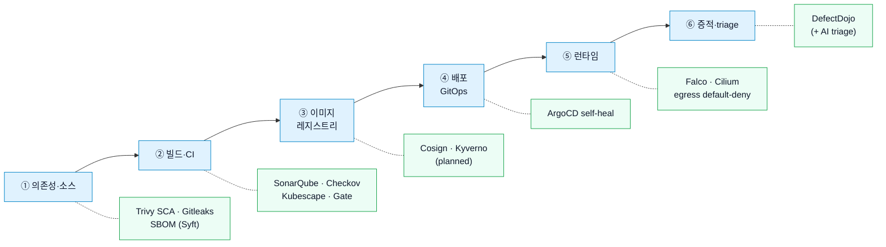

# 위협 모델 & 보안 시나리오

이 장은 "도구가 있다"가 아니라 **"보안담당자가 공격 생애주기의 각 단계에서 무엇을 묻고, 무엇으로 판단·차단·증적하는가"**를 기준으로 정리한다. 출발점은 [해결하려는 문제](overview.md#problem) — 단일 도구의 사각, 1회 검사의 한계, 흩어진 판단·증적 — 이고, 그 답이 아래 단계별 시나리오다.

## 왜 이 시나리오들인가 — 공격 생애주기 → 통제 매핑

방어는 공격의 생애주기를 따라 계층으로 배치된다. 각 단계마다 보안담당자의 질문이 있고, 그 질문에 답하는 통제가 있으며, **최근 실제 공급망 사건이 "왜 그 단계가 중요한지"를 증명한다.**

| 단계 | 보안담당자 질문 | 시나리오 | 통제 | 최근 공급망 사건 |
| --- | --- | --- | --- | --- |
| **① 의존성·소스** | 알려진 악성/취약 버전인가? 과거 빌드도 영향받나? 시크릿이 새는가? | #1 #2 #3 | Trivy · SBOM 재평가 · Gitleaks | axios·node-ipc (known→재평가) · Shai-Hulud (시크릿 탈취) |
| **② 빌드·CI** | 위험한 권한/설정인가? CI 인프라 자체가 변조됐나? | #4 (+ CI 하드닝) | Checkov · Kubescape · Gate · PAT 최소권한 | TanStack (CI 파이프라인 침해) |
| **③ 이미지·레지스트리** | 서명 없는/변조된 이미지가 배포되나? | #5 | Cosign + Kyverno *(planned)* | TanStack · 이미지 변조 |
| **④ 배포·GitOps** | runtime이 Git 선언과 달라졌나? | #6 | ArgoCD self-heal | (무결성 · 드리프트) |
| **⑤ 런타임** | 비즈니스 로직 악용? 셸/파일쓰기? 비정상 egress? | #7 #8 #9 | DAST · Falco · Cilium egress | axios RAT C2 · node-ipc exfil (런타임 차단) |
| **⑥ 증적·triage** | 진짜 조치 대상 vs accepted risk? | #10 #11 | DefectDojo (+ AI) | (전부 — 추적 · SLA · VEX) |

> 최근 공급망 사건별 "어디서 막고 어디서 못 막는가"의 정직한 분석은 [공급망 방어](supply-chain-defense.md)에 계층별로 정리돼 있다.

## 시나리오 매트릭스

| # | 상황 | 보안담당자 질문 | 통제 | 증적 |
| --- | --- | --- | --- | --- |
| 1 | 취약 image build | Critical/High CVE가 배포를 막아야 하는 수준인가? | Trivy + Security Gate | `trivy/`, `gate/` |
| 2 | 신규 CVE 공개 | 과거 build image가 영향받는가? | SBOM 재평가 | `sbom/*.spdx.json`, `sbom/*.cdx.json` |
| 3 | secret 유출 | repo history 또는 config에 credential이 있는가? | Gitleaks | `gitleaks/` |
| 4 | IaC/K8s misconfig | manifest가 위험한 권한/네트워크/컨테이너 설정을 갖는가? | Checkov, Kubescape | `checkov/`, `kubescape/` |
| 5 | 미신뢰 image | registry 외부 image 또는 서명 없는 image가 배포되는가? | TODO: Cosign/Kyverno VerifyImages | TODO |
| 6 | GitOps drift | runtime 상태가 Git 선언과 달라졌는가? | ArgoCD self-heal | ArgoCD Application status |
| 7 | DAST 비즈니스 로직 | IDOR, 음수 송금, 웹셸 업로드가 실제 HTTP 경로에서 재현되는가? | Custom verify + OWASP ZAP baseline | `reports/dev/wsl-poc/evidence/` |
| 8 | Runtime RCE | 컨테이너 내부 shell, PHP file write가 발생하는가? | Falco | Falco logs |
| 9 | Runtime network abuse | 공격 후 비정상 egress 또는 lateral movement가 있는가? | Cilium/Hubble | Hubble flow |
| 10 | Findings triage | 어떤 finding이 진짜 조치 대상이고 어떤 것은 accepted risk인가? | DefectDojo | TODO: DefectDojo engagement/product evidence |
| 11 | AI triage | 반복적인 리포트를 요약하고 근거 연결을 자동화할 수 있는가? | TODO: AI evidence triage | TODO |

## 1. Vulnerable image blocking

상황: Jenkins가 6개 MSA image를 빌드한 뒤 Trivy로 image scan을 수행한다. Build `#3`에서는 6개 service 모두 Security Gate 기준을 넘었다.

판단:

- `ENFORCE_GATE=false`: 취약 실습 워크로드 특성상 build는 계속 진행하되 evidence를 남긴다.
- `ENFORCE_GATE=true`: 동일 finding이면 push 전 hard fail해야 한다.

## 2. New CVE reassessment

SBOM은 신규 CVE 대응의 기준이다. 새 CVE가 공개되면 "지금 build하는 image"뿐 아니라 "이미 Harbor에 push된 과거 image"가 영향을 받는지 다시 묻는다.

운영 질문:

- 어떤 image tag가 영향을 받는가?
- 해당 package가 runtime path에서 실제 사용되는가?
- fixed version이 있는가?
- 즉시 차단, 긴급 재빌드, accepted risk 중 무엇인가?

현재 상태: SBOM 생성은 완료. Dependency tracking 시스템과 자동 재평가 job은 TODO.

> **최근 사건 연결** — axios·node-ipc류는 침해 *직후*엔 advisory가 없어 SCA가 못 잡지만, 며칠 내 GHSA에 등재되면 **저장된 SBOM을 재스캔**해 "우리 배포본이 그 악성 버전을 쓰는가"를 즉시 식별한다. = 1회 검사가 아니라 **시간축 방어**. → [공급망 방어](supply-chain-defense.md)

## 3. Secret leak

Gitleaks는 source와 history에서 secret 후보를 탐지한다. Gate 기준은 finding count 0이다.

운영 질문:

- 실제 secret인가?
- 이미 revoke 되었는가?
- repo history 정리가 필요한가?
- False Positive라면 waiver 근거가 있는가?

## 4. IaC and K8s misconfiguration

Checkov는 multi-tech IaC 관점, Kubescape는 K8s hardening framework 관점이다. 두 도구는 겹치지만 같은 질문을 하지 않는다.

| 도구 | 주 질문 |
| --- | --- |
| Checkov | Dockerfile, Helm, K8s 설정에 알려진 misconfiguration이 있는가? |
| Kubescape | K8s 리소스가 NSA/MITRE/CIS 관점에서 얼마나 어긋나는가? |

## 5. Untrusted image

현재 상태: TODO.

도입 후보:

- Cosign image signing
- Kyverno VerifyImages

이 기능은 "서명 없이 registry에 올라온 image가 GitOps로 배포되는 상황"을 막는 스토리로 도입해야 한다. 단순 도구 추가가 아니라 registry compromise, credential abuse, tag overwrite 시나리오와 연결해야 한다.

> **최근 사건 연결** — TanStack 침해는 **CI 파이프라인을 장악**해 6분 내 84개 악성 아티팩트를 publish했다. 서명 검증(Cosign/Kyverno)이 있으면 미서명·변조 이미지의 배포를 정면 차단한다 — 공급망 무결성의 정공법이자 [로드맵](limitations.md) 최우선 보강. → [공급망 방어](supply-chain-defense.md)

## 6. GitOps drift

ArgoCD는 GitOps repo의 선언 상태와 runtime 상태를 비교한다. self-heal이 켜져 있으면 수동 변경을 되돌린다.

운영 질문:

- 누가 cluster에서 직접 image를 바꿨는가?
- Git에 없는 리소스가 생겼는가?
- ArgoCD가 되돌렸는가?

## 7. DAST business logic

VulnBank MSA에서 의도적으로 보존한 핵심 취약점은 다음 4개다.

| 취약점 | 설명 |
| --- | --- |
| Negative transfer | 음수 송금 요청을 막지 않아 잔액 조작 가능 |
| Transaction history IDOR | 다른 계좌번호로 거래내역 조회 가능 |
| User update IDOR | 다른 사용자 ID로 profile update 가능 |
| File upload RCE | PHP 파일 업로드와 실행 marker 확인 가능 |

이 항목은 SAST만으로 충분하지 않다. 실제 HTTP 요청과 응답 증적이 필요하다.

## 8. Runtime RCE

Falco는 컨테이너 내부의 shell spawn, PHP file write 같은 행위를 syscall 기반으로 탐지하는 역할이다.

현재 GitOps repo에는 Falco Application과 custom rule values가 준비되어 있다. 실제 alert 검증 증적은 TODO.

> **최근 사건 연결** — axios 침해 페이로드는 RAT를 내려받아 **실행**했다. Falco는 컨테이너 내부의 그런 셸 spawn·의심 프로세스를 syscall 기반으로 탐지한다(빌드 검사를 통과한 페이로드의 *행위*를 잡는 마지막 층).

## 9. Runtime network abuse

Cilium/Hubble은 네트워크 정책과 flow visibility를 제공한다. default-deny와 allow-list 정책은 애플리케이션 통신을 깨뜨릴 수 있으므로 단계적으로 적용해야 한다.

현재 상태:

- Cilium/Hubble platform manifest 존재
- Hubble UI exposure manifest 존재
- network policy는 적용 전 검증 필요

> **최근 사건 연결** — RAT C2 통신·credential exfil은 모두 **외부 egress**가 필요하다. Cilium `default-deny`가 허용되지 않은 egress를 차단하면, 악성 코드가 빌드를 통과해 배포돼도 *외부로 나가지 못해* C2·탈취가 무력화된다 — 공급망 방어의 **최강 보완통제**. → [공급망 방어](supply-chain-defense.md)

## 10. DefectDojo triage

DefectDojo는 스캔 결과의 중앙 triage 위치다. CloudWatch/Grafana와 달리 로그/메트릭이 아니라 findings lifecycle을 관리한다.

현재 상태:

- DefectDojo VM user-data 초안 존재
- 실제 ingest pipeline은 TODO

## 11. AI evidence triage

AI triage는 마지막 단계다. 먼저 도구 결과가 안정적으로 쌓이고, accepted risk/false positive 기준이 정리되어야 한다.

현재 상태: TODO.
