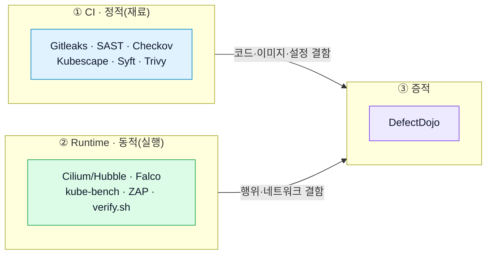

# 보안 도구 동작 원리 — 무엇을 · 어디를 · 어떻게

> 각 도구가 "있다"가 아니라, **언제(빌드 vs 런타임) 무엇을 입력으로 보고, 어떻게 판단하며, 무엇을 남기는가**를 정리한다. 이 구분이 곧 계층방어의 근거다.

!!! abstract "핵심 한 줄"
    **CI = 아직 실행 안 된 "재료"(코드·이미지·설정)를 정적으로 검사** · **Runtime = *돌아가는* 앱·네트워크·프로세스를 관측·차단** · **DefectDojo = 결과를 모아 판단·추적**.

## 1. CI 시점 — 재료를 정적으로 검사

빌드 파이프라인이 코드를 빌드하기 전후로 "재료"를 본다. 실행이 필요 없는 결함(시크릿·CVE·설정·코드 패턴)에 강하다.

| 도구 | 무엇을 바라보나 (입력) | 어떻게 | 산출물 |
| --- | --- | --- | --- |
| **Gitleaks** | 소스 repo 파일 / git 이력 | 정규식·엔트로피로 시크릿 패턴 탐지 | 시크릿 목록(JSON) |
| **SonarQube (SAST)** | 소스 **코드 자체** | 코드 파싱 → 규칙 엔진 → Quality Gate 판정 | 9000 서버: 취약점·핫스팟·보안등급 |
| **Checkov (IaC)** | Dockerfile·Helm·Terraform·K8s YAML | 정책 규칙 매칭 | 통과/실패(JSON) |
| **Kubescape (K8s)** | 렌더된 K8s 매니페스트 | NSA·MITRE·CIS 컨트롤 점검 | 프레임워크별 pass/fail |
| **Syft (SBOM)** | 빌드된 컨테이너 이미지 | 패키지 카탈로깅(인벤토리화) | SPDX · CycloneDX 부품명세 |
| **Trivy (SCA/이미지)** | 빌드된 이미지의 패키지 (+ `trivy config`로 IaC) | 패키지 ↔ CVE DB 대조 | CVE 리포트(JSON) |
| **Security Gate** | 위 결과 집계 | 임계치(예: CRITICAL 0 / HIGH ≤3) | PASS / BLOCK 판정 |

!!! warning "CI 계층의 구조적 한계"
    위 도구들은 **아직 실행되지 않은 재료**를 본다. 그래서 *실행돼야 드러나는* 결함 — 비즈니스 로직(음수 송금), 인가(IDOR) — 은 구조적으로 놓친다. 실제로 SonarQube SAST는 VulnBank의 의도된 4개 취약점을 **0/4** 탐지했다(상세: [탐지 효능](detection-efficacy.md)). "SAST가 무능"이 아니라 **그 클래스가 SAST의 시야 밖**이라는 뜻 — 그래서 DAST·런타임 계층이 필요하다.

## 2. Runtime 시점 — 돌아가는 앱을 관측·차단

배포되어 실행 중인 애플리케이션·네트워크·프로세스를 본다. CI가 놓친 동작 기반 결함을 잡는다.

| 도구 | 무엇을 바라보나 | 어떻게 | 산출물 / 효과 |
| --- | --- | --- | --- |
| **ArgoCD** *(보안X, 배포기)* | GitOps repo 감시 | 선언적 동기화(Git=단일 진실) | k3s 자동 배포·드리프트 교정 |
| **Cilium / Hubble** | 파드 간 네트워크 트래픽(L3–L7) | eBPF로 흐름 관측 + 정책 차단 | flow 로그, `default-deny` egress 차단 |
| **Falco** | 컨테이너 내 syscall·프로세스 행위 | 커널 이벤트 + 규칙 | 이상행위 경보(예: 셸 spawn, 의심 실행) |
| **kube-bench** | k3s 클러스터·노드 설정 | CIS 벤치마크 점검 | CIS pass/fail |
| **OWASP ZAP (DAST)** | 실행 중인 앱의 HTTP 엔드포인트 | spider + 수동/능동 스캔 | 웹 취약점 리포트 |
| **verify.sh (비즈로직 DAST)** | 실행 중인 앱 API | 조작된 공격 요청(음수송금·IDOR·웹쉘) | PASS/FAIL = **취약점 실제 재현** |

!!! success "런타임이 CI의 공백을 메운다 (실측)"
    AWS 라이브 DAST에서 SAST가 0/4로 놓친 취약점 중 **3/4(음수송금·IDOR·웹쉘 RCE)를 실제 요청으로 재현**했다(웹쉘은 프론트엔드 게이트웨이 통해 **실제 실행**까지). 그리고 Cilium `default-deny`는 악성 페이로드가 빌드를 통과해도 **외부 C2·exfil 통신을 차단**한다 — 공급망 공격의 *효과*를 런타임에서 막는 최후 보완통제([공급망 방어](supply-chain-defense.md)).

## 3. 증적 통합 — 결과를 한곳에 모아 판단

| 도구 | 무엇을 바라보나 | 어떻게 |
| --- | --- | --- |
| **DefectDojo (ASOC)** | CI가 import한 모든 도구 결과 | 통합 · 중복제거 · triage 상태(False Positive / Accepted Risk / VEX) · SLA |

> DefectDojo는 6개 컨테이너(nginx·uwsgi·celery worker/beat·postgres·valkey)로 구성되지만 **도구는 하나**다 — 웹·앱·작업큐·DB·캐시의 부품 분리일 뿐.

## 4. 한눈에 — 어느 계층이 무엇을 보는가

| 관측 대상 | 계층 | 담당 도구 |
| --- | --- | --- |
| 소스 코드·시크릿 | CI(정적) | SAST · Gitleaks |
| 의존성·이미지 CVE | CI(정적) | Trivy · Syft |
| 인프라·K8s 설정 | CI(정적) | Checkov · Kubescape · kube-bench |
| 비즈로직·인가(IDOR·음수송금) | Runtime(동적) | DAST(verify.sh·ZAP) |
| 네트워크 흐름·egress | Runtime(동적) | Cilium / Hubble |
| 프로세스·syscall 행위 | Runtime(동적) | Falco |
| 결과 통합·triage | 증적 | DefectDojo |

> 관측 메트릭 시각화(Grafana/Prometheus)는 현재 계획 — Hubble·도구 메트릭을 대시보드화하는 단계가 로드맵에 있다.

## 더 보기
- 각 도구의 실제 탐지 수치·정탐/오탐: [탐지 효능](detection-efficacy.md)
- 파이프라인 단계별 실행: [CI 보안 파이프라인](ci-security-pipeline.md)
- 이 도구들이 구현된 실제 파일 위치: [코드·설정 맵](code-map.md)
