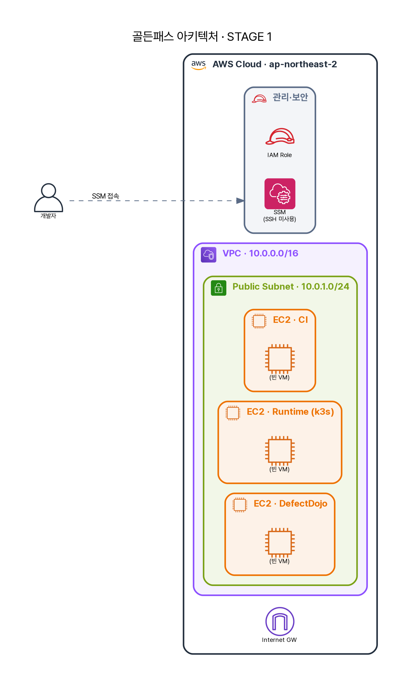

# 1장 · 인프라 — "어… SSH가 안 되는데요?"

A의 첫 임무는 단순했다. *"파이프라인 올리기 전에, 인프라부터 세워."* 빈 AWS 계정과 골든패스 저장소 하나. A는 `infra-terraform-repo`를 클론하고 `terraform apply`를 친다. 몇 분 뒤 — EC2 세 대가 떴다.

{ loading=lazy }

> 지금은 **빈 VM 세 대**다. CI 한 대, 런타임(k3s) 한 대, 증적(DefectDojo) 한 대. 12장을 지나면 여기에 도구가 하나씩 쌓인다.

## 한 번에 세 대 — terraform이 하는 일

A가 친 `terraform apply` 한 줄이 무엇을 만들었는지 코드로 보자. 네트워크·IAM·보안그룹·EC2가 모듈로 쪼개져 있다.

```hcl title="infra-terraform-repo/envs/dev/main.tf"
module "network"         { source = "../../modules/network"  ... }   # VPC + Public Subnet + IGW
module "iam"             { source = "../../modules/iam"      ... }   # EC2가 달 IAM Role(SSM·ECR 등)
module "security_groups" {
  source             = "../../modules/security-groups"
  allowed_admin_cidr = var.allowed_admin_cidr                        # ← 관리 접근을 내 IP로 제한
}

module "ec2" {
  source                = "../../modules/ec2"
  instance_profile_name = module.iam.instance_profile_name
  ci_user_data         = file("${path.module}/../../scripts/user-data/ci-server.sh")
  runtime_user_data    = file("${path.module}/../../scripts/user-data/runtime-server.sh")
  defectdojo_user_data = file("${path.module}/../../scripts/user-data/defectdojo-server.sh")
}
```

A가 주목한 건 두 가지다. 하나, `allowed_admin_cidr` — 관리 접근(웹 UI·API)을 **0.0.0.0/0이 아니라 특정 IP로** 좁힌다. 둘, 각 VM의 `*_user_data`로 **셸 스크립트**가 들어간다. VM은 켜지면서 *스스로 무장*한다.

## VM이 켜지면 스스로 도구를 깐다 — user-data

`ci-server.sh`가 실제로 무엇을 설치하는지. (발췌, 실제 파일)

```bash title="infra-terraform-repo/scripts/user-data/ci-server.sh"
set -euxo pipefail
dnf install -y docker git jq unzip tar python3 python3-pip
systemctl enable --now docker

# IMDSv2 토큰으로 자기 사설 IP를 알아낸다 (Harbor hostname에 사용)
TOKEN=$(curl -sX PUT "http://169.254.169.254/latest/api/token" \
  -H "X-aws-ec2-metadata-token-ttl-seconds: 300")
PRIV_IP=$(curl -s -H "X-aws-ec2-metadata-token: ${TOKEN}" \
  http://169.254.169.254/latest/meta-data/local-ipv4)

# Harbor는 http(8082)로 쓸 거라, docker가 그 레지스트리를 신뢰하도록 미리 설정
mkdir -p /etc/docker
cat > /etc/docker/daemon.json <<EOF
{ "insecure-registries": ["${PRIV_IP}:8082"] }
EOF
systemctl restart docker

# Jenkins는 Java 21 필요 (Java 17로 깔면 안 뜬다 — 실제로 밟은 함정)
dnf install -y java-21-amazon-corretto
dnf install -y jenkins
usermod -aG docker jenkins          # 파이프라인이 호스트 docker로 이미지 빌드

# 스캐너 CLI들 — 이게 다음 장들의 주인공이다
curl -sfL .../trivy/.../install.sh   | sh -s -- -b "$BIN"   # 이미지·SBOM 취약점
curl -sSfL .../syft/.../install.sh   | sh -s -- -b "$BIN"   # SBOM 생성
curl -sSfLo "$BIN/cosign" .../cosign-linux-amd64                  # 이미지 서명(준비)
# gitleaks(시크릿) · kubescape(K8s NSA/MITRE/CIS) 도 여기서 설치
```

A는 깨달았다. **인프라가 곧 코드다.** 누가 손으로 도구를 깔지 않는다. VM을 다시 만들면 똑같은 무장 상태가 재현된다 — "내 노트북에선 됐는데"가 사라진다.

## "SSH가 안 되는데요?"

스크립트가 끝나길 기다리며, A는 습관대로 `ssh ec2-user@…`를 쳤다. **안 된다.** 22번 포트가 닫혀 있다.

지나가던 시니어. *"거기 SSH 없어. SSM 써."*

```bash
aws ssm start-session --target i-05d583e02dcb52aef
```

세션이 열린다. *왜 굳이?* — **SSH 키는 분실·유출·공유의 온상**이다. 키 하나 새면 끝이고, 누가 언제 들어왔는지 추적도 약하다. SSM Session Manager는 **키 없이 IAM 권한으로** 들어가고(그래서 1장의 `module.iam`이 필요했다), **모든 접속이 CloudTrail에 기록**된다. 골든패스의 첫 철학 — *접속 자체를 증적으로 남긴다.*

<div class="sb-key" markdown>
📓 **A의 메모**: 보안은 도구를 더 까는 게 아니라, *"누가 무엇을 했는지 남는가"*에서 시작한다. SSH를 없앤 게 핵심이 아니라, 접근을 **IAM + 감사 로그**로 통제한 게 핵심이다.
</div>

## 한계 — 면접에서 물어볼 것

미화하지 말자. 1장의 구성에도 빈틈이 있고, 면접관은 거길 찌른다.

- **"SSM이면 완벽한가요?"** → 아니다. SSM 에이전트가 죽거나 IAM이 꼬이면 *들어갈 길이 없다*. 실무에선 **비상(break-glass) 경로**를 따로 설계한다. "SSH를 없앴다"가 아니라 "접근을 IAM·감사로 통제했다"가 정확한 표현.
- **"VM들이 퍼블릭 서브넷에 떠 있네요?"** → 그렇다. 퍼블릭 서브넷 + 공인 IP다. `allowed_admin_cidr`로 관리 접근을 한 IP로 좁혔지만, 웹 포트는 여전히 인터넷에 *면해* 있다. 프로덕션이라면 **프라이빗 서브넷 + Bastion/VPN**이 정석이다. 이건 PoC라 단순화한 것이고, 그 트레이드오프를 *아는 것*이 중요하다.
- **"레지스트리를 http로 쓴다고요?"** → 그렇다. `insecure-registries`로 Harbor를 평문 http로 신뢰하게 했다. 이미지 전송이 **TLS로 암호화·검증되지 않는다**. 사설 네트워크 안이라 PoC에선 감수했지만, 공급망 무결성 관점에선 갭이다(나중 장에서 다시 만난다).

> A는 첫날부터 배운다 — **"세웠다"와 "안전하다"는 다르다.** 이 교본은 둘의 거리를 좁히는 기록이다.

---

다음 → **2장 · 첫 관문 Gitleaks**. 빈 CI VM에 Jenkins를 올리고, 18단계 파이프라인의 첫 스캐너를 돌리자 — A의 코드에서 비밀번호가 튀어나온다.
