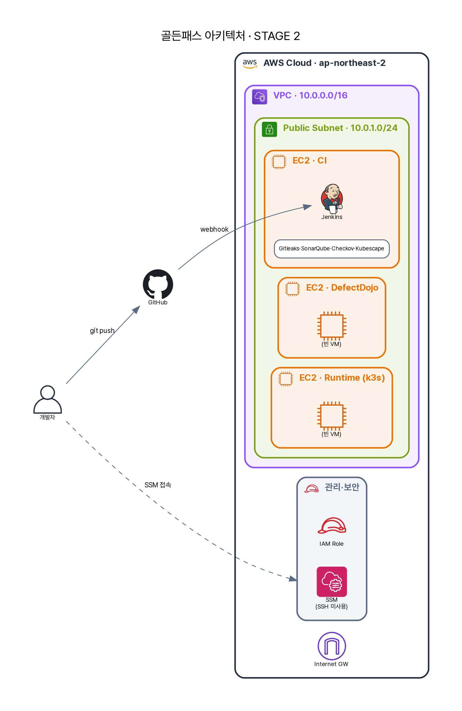

# 3화 · "API 키가 깃허브에 올라갔어요"

## 🎬 사건

월요일 아침, 옆 팀이 발칵 뒤집혔다. 한 개발자가 실수로 **AWS 액세스 키가 박힌 파일을 퍼블릭 레포에 푸시**했고 — 몇 시간 만에 누군가 그 키로 EC2 수십 대를 띄워 암호화폐를 캤다. 청구서가 날아오고 나서야 알았다.

A는 등골이 서늘했다.

> **A**: (혼잣말) *"우리 결제 레포는… 괜찮나? 예전에 누가 비번 커밋했다가 지운 건 없나? 커밋이 수천 갠데, 그걸 손으로 다 뒤져?"*

손으로는 불가능하다. 그리고 **"지웠으니 괜찮다"가 안 통한다** — git은 지운 것도 히스토리에 남긴다. 한 번 커밋된 비번은, 이미 샌 비번이다.

{ loading=lazy }

> 작업장(1화)에 **CI 파이프라인**이 붙었다. 개발자가 push하면 Jenkins가 18단계 검사를 돈다. 이번 화의 **Gitleaks**가 그 *첫 관문*이다.

## 💡 해결책 — Gitleaks, "히스토리까지 뒤지는 시크릿 사냥꾼"

**왜 Gitleaks인가?** 단순 텍스트 검색이 아니다. 두 가지로 잡는다 —
1. **패턴(정규식)**: `AKIA[0-9A-Z]{16}`(AWS 키), 토큰·프라이빗키의 *생김새*를 안다.
2. **엔트로피**: 무작위에 가까운 고엔트로피 문자열은 사람이 만든 단어가 아니라 *비밀*일 확률이 높다.

그리고 결정적으로 — **현재 코드가 아니라 git 히스토리 전체**를 훑는다. 파이프라인에서 실제로 이렇게 부른다.

```bash title="devsecops-path/scripts/gitleaks-scan-repos.sh"
gitleaks detect \
  --source "${repo_dir}" \
  --no-banner \
  --report-format json \
  --redact \                         # ← 리포트에 시크릿 '값'은 가린다 (리포트가 또 새지 않게)
  --report-path "${output_file}" \
  --exit-code 1                      # ← 하나라도 찾으면 exit 1 = 게이트가 막는다
```

A는 이 한 줄을 주목했다. `--redact` — *발견 리포트조차 시크릿을 노출하지 않는다.* 그리고 `--exit-code 1` — 발견 = 빌드 실패. 이 스크립트는 세 레포(`devsecops-path`·`app-source-repo`·`gitops-manifest-repo`)를 차례로 훑는다.

## 🔌 파이프라인에 어떻게 꽂히나

[2화](02-pipeline.md)의 `REPORT_DIR` 규약 덕에, Gitleaks를 끼우는 데 한 일은 *스크립트 하나*뿐이다.

- **스테이지**: `stage('Gitleaks Secret Scan') { sh 'bash scripts/gitleaks-scan-repos.sh' }`
- **출력 칸**: 결과를 `${REPORT_DIR}/gitleaks/<repo>.json` 에 쓴다 (자기 칸에만)
- **게이트 연결**: `security-gate-services.sh`가 `…/gitleaks/*.json`을 읽어 `GITLEAKS_MAX_FINDINGS=0`과 비교 → `GITLEAKS_GATE_RESULT=BLOCK/PASS`

도구를 *직접* 엮지 않는다. "자기 칸에 JSON을 쓴다"는 약속만 지키면 게이트가 알아서 종합한다. 새 시크릿 스캐너로 갈아끼워도 파이프라인은 안 바뀐다.

## 🔍 돌려봤더니

A가 파이프라인을 돌렸다. 결과 — **하드코딩 시크릿 2건.** `getstatus.php`의 DB 비번, 설정 파일의 토큰. (Build #3 실측)

게이트 기준은 단호하다. **secret finding = 0.** 하나라도 있으면 push 전에 막는다(`GITLEAKS_MAX_FINDINGS=0`).

> 🎤 A는 시니어의 금요일 질문에 처음으로 *한 줄*을 답할 수 있게 됐다. *"시크릿 2건 때문에 게이트가 막았고, 키 폐기(rotate) 후 다시 돌렸습니다."*

## ⚠️ 한계 — 면접관이 찌른다

- **"Gitleaks면 시크릿 다 잡나요?"** → 아니다. 패턴·엔트로피 기반이라 **새로운 형태의 시크릿은 놓치고(미탐)**, 반대로 무작위처럼 생긴 정상 문자열을 비밀로 **오인(오탐)**하기도 한다.
- **"오탐은 어떻게요?"** → `.gitleaksignore`로 예외 처리하되, "무시"가 아니라 **근거(왜 시크릿이 아닌지)를 남긴** 예외여야 한다.
- **"발견하면 끝인가요?"** → 아니다. Gitleaks는 *발견*하지 *무효화*하지 않는다. 커밋된 비번은 **이미 유출된 것으로 간주하고 rotate**해야 한다. (히스토리 정리는 그다음.)

## 🧭 시니어의 4가지 렌즈

세계 최고의 보안 엔지니어는 "시크릿 스캐너 깔았다"에서 멈추지 않는다. 같은 통제를 **네 각도**로 본다.

| 렌즈 | 이 통제가 의미하는 것 |
| --- | --- |
| **기술 (Tech)** | 정규식+엔트로피로 git *히스토리 전체*를 훑어 시크릿 탐지. `--redact`로 리포트의 2차 유출까지 차단 |
| **규제 (Regulation)** | ISMS-P 2.8 개발보안·2.5 인증/권한·2.7 암호화 / PCI-DSS Req 6.3·8 / 전자금융 자격증명 관리 |
| **정책 (Policy)** | "소스·저장소에 시크릿을 두지 않는다"는 조직 정책을 **게이트(시크릿 0개)로 *집행***한다 — 문서로 선언만 하는 정책이 아니라 코드로 강제되는 정책(policy-as-code) |
| **관리 (Governance)** | 핵심은 탐지가 아니라 *대응 거버넌스* — 발견 = **유출 간주 → 즉시 키 폐기(rotate)**가 표준 절차. 오탐 예외(`.gitleaksignore`)는 *근거·승인*을 남기고, 누적 추세는 개발팀 보안 KPI로 경영진에 보고 |

> 🎤 **면접 한 줄**: *"Gitleaks는 ISMS-P 2.8을 자동 집행하는 통제입니다. 다만 진짜 핵심은 탐지가 아니라 '발견=유출 간주→폐기'라는 대응 정책과 그 증적 — 도구가 아니라 프로세스가 통제를 완성합니다."*

---

비번은 잡았다. A는 자신감이 붙어, 이번엔 **코드 자체의 약점**을 보는 SAST(정적분석)를 돌린다. 의도된 취약점이 네 개나 심어진 코드인데 — 결과를 본 A는 멍해진다. **0개.** 하나도 못 잡았다.

> 다음 → **4화 · "음수로 송금했더니 잔액이 늘어요"** — SAST의 0/4 충격
