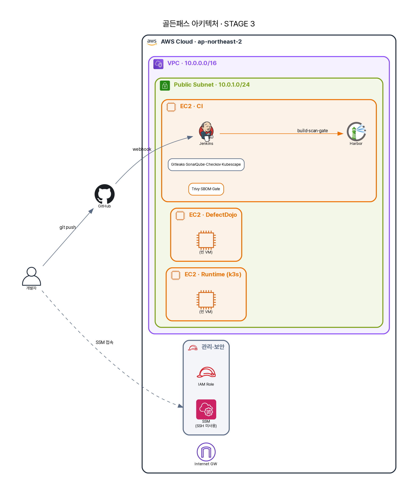

# 7화 · "이미지에 CVE가 6천 개?"

## 🎬 사건

빌드까지 통과한 이미지를 A가 마지막으로 스캔했다. 결과 화면을 보고 그는 의자에서 뒤로 넘어갈 뻔했다.

```
user-service 이미지 — CRITICAL 29 · HIGH 1319 · MEDIUM 4428 · LOW 931
```

> **A**: "6천 개?! 우리가 코드를 그렇게 많이 짜지도 않았는데, 취약점이 *6천 개*라고?"

{ loading=lazy }

> 파이프라인이 한 단계 자랐다 — 이제 이미지를 *빌드*하고, **SBOM**(구성요소 목록)을 만들고, **Trivy**로 이미지 CVE를 본 뒤 레지스트리(Harbor)로 보낸다.

## 💡 해결책 — Trivy(이미지 CVE) + SBOM

**왜 둘을 같이?** 이미지에 *무엇이 들어있는지* 모르면 *무엇이 취약한지*도 모른다. 그래서 먼저 **SBOM**(Software Bill of Materials)을 뽑고, 그 위에서 CVE를 본다. 이 파이프라인은 Trivy 하나로 둘 다 한다.

```bash title="devsecops-path/scripts (실제) — Trivy로 SBOM 2종 + CVE 스캔"
# SBOM (표준 2포맷)
trivy image --no-progress --format spdx-json    --output "${spdx_file}" "${image}"
trivy image --no-progress --format cyclonedx    --output "${cdx_file}"  "${image}"
# 취약점 스캔
trivy image --exit-code 0 --no-progress --format json --output "${trivy_json}" "${image}"
```

### 🔌 파이프라인에 어떻게 꽂히나
- **스테이지**: `Generate SBOM` → `Trivy Scan Services` (서비스 6개 각각)
- **출력**: `REPORT_DIR/sbom/<service>.spdx.json`·`.cdx.json`, `REPORT_DIR/trivy/trivy-report-<service>.json`
- **게이트 연결**: 게이트가 Trivy JSON을 읽어 `GATE_MAX_CRITICAL=0`·`GATE_MAX_HIGH=3`과 비교 → 6서비스 모두 **BLOCK** (Build #3)

## 🔍 돌려봤더니 — 6천 개의 정체

A가 CVE들을 까보니 충격적인 사실 — *거의 다 자기 코드가 아니었다.* 대부분이 **`php:7.4`(EOL) 베이스 이미지**의 OS 패키지 CVE였다. 예: `curl` CVE-2023-38545, `glibc` CVE-2023-4911.

> 📓 **A의 깨달음**: 6천 개는 6천 개의 문제가 아니다. **단일 근본 원인 — 낡은 베이스 이미지** 하나가 수천 건을 만든다. "취약점 개수"에 압도되지 말고 *근본 원인*을 보라. 베이스 이미지를 `php:8.x-slim`이나 distroless로 바꾸면 수천 개가 한 번에 사라진다.

## ⚠️ 한계 — 그리고 다음 화의 복선

- **"Trivy면 공급망 공격 막나요?"** → **여기가 핵심이다.** Trivy는 **이미 알려진(advisory/CVE 등재된) 취약점만** 잡는다. axios가 *침해된 바로 그 순간*엔 advisory가 없다 → **0-day 공급망 악성 패키지는 Trivy가 못 잡는다.** SCA를 "공급망 1차 방어"로 과신하면 안 된다.
- **"6천 개를 다 고쳐요?"** → 불가능하고 불필요하다. *도달 가능성(실제 실행 경로)*과 *수정 가능 여부(fixed version)*로 트리아지한다. VEX(영향 없음)도 정당한 결론이다.
- **"개수가 보안 지표인가요?"** → 아니다. 6천이라는 숫자보다 "CRITICAL이 게이트를 BLOCK했는가"가 의미 있다.

## 🧭 시니어의 4가지 렌즈

| 렌즈 | 이 통제가 의미하는 것 |
| --- | --- |
| **기술 (Tech)** | SBOM(구성요소 목록) 위에서 *알려진* CVE 매칭. 대부분은 베이스 이미지 단일 근본원인 — 0-day는 사각 |
| **규제 (Regulation)** | ISMS-P 2.10 취약점·패치 관리·2.8 공급망(도입 컴포넌트 추적) / PCI-DSS Req 6.2(패치)·Req 11 / 전자금융 보호대책 |
| **정책 (Policy)** | 게이트 임계값(CRITICAL 0)이 "이 위험 이상은 배포 불가" 정책. *승인된 베이스 이미지*만 쓰게 하는 골든 이미지 정책으로 확장 |
| **관리 (Governance)** | SBOM은 *자산 인벤토리*다 — "우리가 무엇을 배포했나"의 기록. 이게 있어야 다음 화의 *사후 재평가*가 가능하다. 미수정 CVE의 위험 수용은 보안책임자 승인 |

> 🎤 **면접 한 줄**: *"CVE 6천 개는 대부분 EOL 베이스 이미지 하나가 만든 숫자입니다. 더 중요한 건 — Trivy는 known-bad만 잡습니다. axios 같은 0-day 공급망은 빌드 시점엔 못 막아요. 그걸 어떻게 메우냐가 다음 이야기입니다."*

---

오늘 스캔은 통과시켰다 치자. 그런데 A의 머릿속에 시니어가 던진 그 링크가 맴돈다 — *"axios 또 털렸대."* 오늘 깨끗했던 이미지가, **내일 새 CVE가 공개되면** 갑자기 위험해진다면? 이미 배포된 건?

> 다음 → **8화 · "어제 통과한 게 오늘 위험해졌어요"** — SBOM 시간축 재평가
