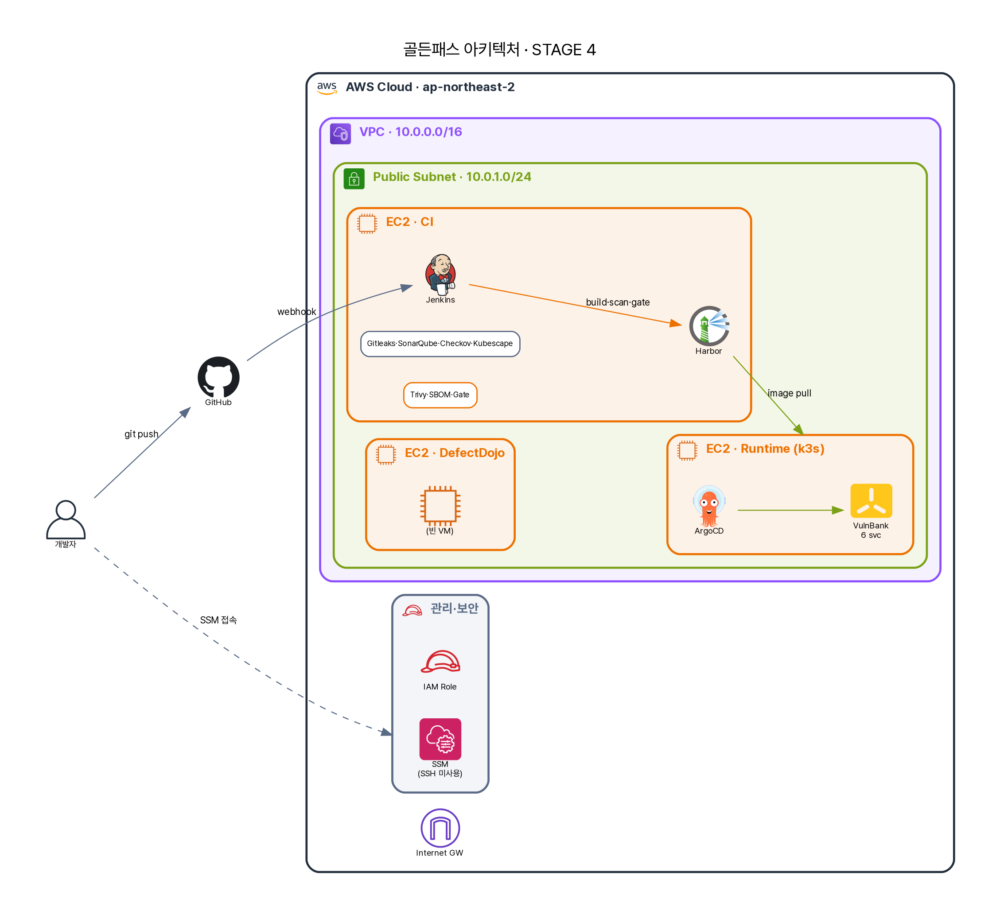

# 10화 · "누가 운영 이미지를 손으로 바꿨어요"

CI의 여섯 관문을 통과한 이미지가 클러스터에 떴다. 평화로운 줄 알았다. 그러던 어느 날, A가 운영 파드의 설정을 확인하다 이상한 걸 봤다. *매니페스트(git)엔 없는 환경변수가, 실제 파드엔 들어가 있었다.*

> "이거… git엔 없는데요? 누가 넣었어요?"
> "아, 지난주에 장애 나서 내가 `kubectl edit`로 급하게 넣었어. 까먹고 있었네."

A는 등골이 서늘했다. 급한 불은 껐다. 하지만 이제 **git과 실제 클러스터가 다르다.** git을 봐선 운영이 어떤 상태인지 알 수 없다. 다음 배포 때 그 핫픽스가 조용히 사라질 수도, 영원히 남을 수도 있다. 누가·언제·왜 그 변경을 했는지는 *한 사람의 기억* 속에만 있다. 그 사람이 퇴사하면? 이게 **드리프트(drift)** — 선언과 실제가 어긋난 상태다.

보안의 관점에서 이건 단순한 운영 사고가 아니다. *클러스터를 직접 만질 수 있다*는 것 자체가 공격 표면이다. 누군가(혹은 침입자가) `kubectl`로 운영을 바꾸고 흔적을 지우면, 아무도 모른다. git이 진실이 아니면 — 추적도, 롤백도, 감사도 무너진다.

{ loading=lazy }

## git을 단일 진실로 — 그리고 사람의 손을 끊는다

해법은 발상의 전환이다. *사람이 클러스터를 만지는 걸 막는 게 아니라, 클러스터를 만지는 유일한 방법을 git으로 만든다.* 이게 **GitOps**다. git에 선언된 것이 *단일 진실 공급원(single source of truth)*이고, 도구가 그 선언을 클러스터에 *계속 맞춘다.*

그 도구가 ArgoCD다. 실제 설정은 이렇다.

```yaml title="argocd/applications/vulnbank-msa-dev.yaml (실제)"
spec:
  source:
    repoURL: https://github.com/.../gitops-manifest-repo.git   # 진실은 여기에 있다
    targetRevision: main
    path: apps/vulnbank-msa/dev
  destination:
    server: https://kubernetes.default.svc
    namespace: secure-path-dev
  syncPolicy:
    automated:
      prune: true        # git에서 지운 건 클러스터에서도 지운다
      selfHeal: true     # 클러스터가 git과 달라지면 git대로 되돌린다
```

세 부분이 핵심이다. `source`는 "진실은 여기 있다"(gitops 레포의 그 경로)를 가리키고, `destination`은 "이걸 이 클러스터·이 네임스페이스에 반영하라"고 말한다. 그리고 `syncPolicy.automated` — 여기가 드리프트를 끝내는 곳이다. `selfHeal: true`는 클러스터가 git과 *달라지면* ArgoCD가 **git대로 되돌린다.** 누가 `kubectl edit`로 바꿔도 잠시 뒤 원상복구된다 — 핫픽스를 손으로 넣는 그 행위 자체가 *무효화*된다. `prune: true`는 git에서 *지운* 리소스를 클러스터에서도 지운다. "git엔 없는데 클러스터엔 있는" 유령 리소스를 허용하지 않는다.

이제 운영을 바꾸는 유일한 길은 *git에 PR을 올리는 것*이다. 그리고 그게 보안의 핵심이다.

## kubectl 권한이 아니라, merge 권한

A가 무릎을 친 지점. GitOps는 "자동 배포 편하다"가 아니다. **접근통제의 재설계**다. 예전엔 "누가 운영 클러스터에 kubectl을 쓸 수 있나"가 질문이었다 — 위험하고, 추적이 약하고, 실수가 곧 사고였다. GitOps에선 그 질문이 사라진다. *아무도* 운영을 직접 안 만진다(ArgoCD만 만진다). 사람이 가진 건 *git에 merge할 권한*뿐이다.

그러면 모든 변경이 — 핫픽스조차 — PR이 된다. 리뷰를 거치고, 누가 언제 왜 바꿨는지 git 히스토리에 남고, 한 줄 revert로 되돌릴 수 있다. 운영 변경의 *감사 로그*가 git 그 자체가 된다. "누가 운영을 바꿨어요?"라는 10화의 질문이, GitOps에선 `git log`로 1초 만에 답된다.

## 그런데 self-heal이 늘 정답은 아니다

미화하지 말자. `selfHeal: true`는 양날이다. 진짜 장애 상황에서, 엔지니어가 응급으로 넣은 변경을 ArgoCD가 *되돌려버리면* 불을 끄던 손이 묶인다. 그래서 실무는 **break-glass 절차**를 둔다 — 비상시 self-heal을 일시 중단하거나, 응급 변경을 *즉시 git에도 반영*하는 규율. "손으로 바꾸지 말라"가 "장애에도 손대지 말라"가 되면 안 된다. 자동 동기화의 강함과 비상 대응의 유연함 사이를 정책으로 설계해야 한다.

더 정직하게 — GitOps는 *전달 경로*를 안전하게 만들지만, *전달되는 것*이 안전한지는 보장하지 않는다. git에 선언된 이미지가 *신뢰할 수 있는 이미지*인지(서명됐는지, 변조 안 됐는지)는 GitOps의 일이 아니다. 그건 이미지 서명(Cosign)과 admission 정책(Kyverno)의 영역이고 — 이 PoC는 거기까진 구현하지 않았다(정직하게 미구현). 그리고 ArgoCD 자신이 클러스터에 강한 권한을 쥔다는 것도 잊으면 안 된다 — ArgoCD가 뚫리면 GitOps 전체가 뚫린다. *진실의 단일 지점은, 공격의 단일 지점이기도 하다.*

## A가 정리한 자리들

기술적으로 GitOps는 git을 단일 진실로 삼아 ArgoCD가 선언과 실제를 지속 비교하고, selfHeal·prune으로 드리프트를 자동 교정한다 — 운영의 상태가 *언제나 git에 적힌 그대로*임을 보장한다. 규제로 옮기면, 모든 변경이 PR·git 히스토리로 남는다는 건 ISMS-P 2.9(변경 관리)와 2.6(접근통제)을 *구조적으로* 충족하는 것이다 — 변경 승인·이력·롤백이 git이라는 단일 메커니즘에 통합된다. 정책의 영역에서, "운영은 누구도 직접 만지지 않는다, 변경은 오직 git을 통한다"가 정책이 되고 break-glass의 발동 조건·승인자가 그 예외 조항이다. 관리의 영역에서, 운영 변경의 거버넌스가 *코드 리뷰 거버넌스*와 하나가 된다 — 누가 merge 권한을 갖는지, 응급 변경을 누가 사후 승인하는지가 운영 통제의 본문이 된다.

A가 10화에서 얻은 문장. **운영을 바꾸는 유일한 길이 git이면, git이 곧 통제다.**

---

이제 배포는 안전하고 추적 가능하다. CI가 검사하고, GitOps가 충실히 전달한다. 그런데 — *충실히 전달한다*는 게 문제가 될 줄, A는 몰랐다. 8화에서 빌드 게이트를 통과해버린 그 axios식 0-day가, 정상 이미지에 섞여 GitOps를 타고 운영에 *완벽하게* 배포됐다. 그리고 지금, 그 악성코드가 외부의 누군가에게 *데이터를 빼돌리려* 하고 있다.

> 다음 → **11화 · "악성코드가 데이터를 빼돌려요"** — 런타임 egress 차단, Cilium
