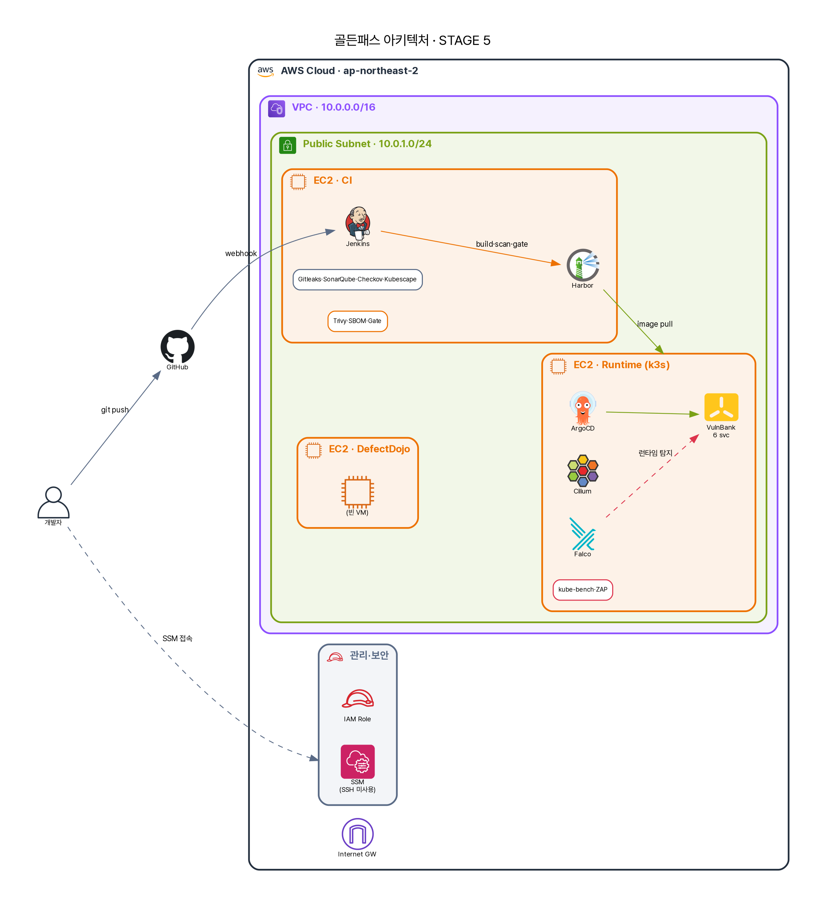

# 11화 · "악성코드가 데이터를 빼돌려요"

10화에서 GitOps는 제 일을 완벽하게 했다. CI를 통과한 이미지를 *충실히* 운영에 배포했다. 문제는 — 그 이미지 안에, 8화에서 빌드 게이트의 시간 창을 빠져나간 axios식 0-day가 섞여 있었다는 것이다. 정상 버전 번호를 단 악성 패키지. 스캔도 통과했고, 게이트도 통과했고, GitOps는 그걸 *의심 없이* 운영에 올렸다.

그리고 지금, 그 악성코드가 깨어났다. 파드 안에서 조용히, 외부의 어떤 서버로 *연결을 시도*한다. 고객 데이터를 한 줌씩 실어 보내려고. 공급망 공격의 진짜 목적 — *데이터 유출(exfiltration)*과 *원격 조종(C2)* — 이 비로소 실행되는 순간이다.

> A: "코드도 검사했고, 이미지도 스캔했고, 배포도 안전했는데… 어떻게 지금 데이터가 나가고 있죠?"

답은 불편하다. 앞의 모든 통제는 *배포되기 전*을 봤다. 지금 벌어지는 건 *배포된 뒤, 실행 중*의 일이다. 그리고 기본값의 쿠버네티스에서, 파드는 인터넷 *어디로든* 나갈 수 있다.

{ loading=lazy }

## 기본적으로, 파드는 어디로든 나갈 수 있다

많은 사람이 놓치는 사실이다. 쿠버네티스 파드의 egress(외부로 나가는 트래픽)는 **기본적으로 활짝 열려 있다.** 별도 정책이 없으면, 침해된 파드는 C2 서버에 접속하고, 추가 악성코드를 내려받고, 데이터를 실어 나르고, 봇넷에 합류한다 — 아무도 막지 않는다. 공급망 공격의 *페이로드*가 사는 곳이 바로 여기, 런타임 egress다.

그래서 필요한 게 **egress default-deny** — "명시적으로 허용한 곳 외에는, 나가는 모든 트래픽을 막는다"는 정책이다. A는 Cilium으로 이걸 건다.

```yaml title="적용한 정책 — egress default-deny (secure-path-dev)"
apiVersion: cilium.io/v2
kind: CiliumNetworkPolicy
metadata:
  name: egress-default-deny
  namespace: secure-path-dev
spec:
  endpointSelector: {}                 # 이 네임스페이스의 모든 파드에
  egress:
    - toEndpoints:                      # DNS(kube-dns)만 예외로 허용
        - matchLabels:
            k8s:io.kubernetes.pod.namespace: kube-system
            k8s-app: kube-dns
      toPorts: [{ ports: [{ port: "53" }] }]
    # 그 외 모든 외부(world)로의 egress는 — 암묵적으로 DROP
```

Cilium은 이걸 *커널에서 eBPF로* 강제한다. 그리고 Hubble이 그 모든 트래픽을 관측한다. 정책을 걸고, 파드 안에서 외부로 나가는 척 해봤다.

## 돌려봤더니 — SYN 한 방에 DROPPED

A가 침해 파드를 흉내 내, transaction-service 파드에서 외부 IP로 연결을 시도했다.

```text title="egress 차단 실측 — AWS 라이브 (SSM command-id ba96945a…)"
# 파드 안에서 외부로 나가려는 시도 (C2 흉내)
curl ×3  →  http_code=000  /  curl_exit=28 (timeout)

# Hubble가 그 순간 관측한 것:
16:35:52  secure-path-dev/transaction-service-…:33938  <>  1.1.1.1:80 (world)
          Policy denied  DROPPED  (TCP Flags: SYN)
```

읽어보자. 파드가 외부(`1.1.1.1:80`)로 보낸 첫 SYN 패킷이 — *연결이 시작되기도 전에* — `DROPPED`됐다. `curl_exit=28`은 타임아웃, `http_code=000`은 *응답이 아예 없음*. 악성코드가 C2에 손을 뻗는 그 첫 동작이 커널에서 잘렸다. 데이터는 한 바이트도 못 나갔다.

이게 공급망 공격에 대한 **정직한 답**의 핵심이다. 우리는 axios가 침해된 순간을 막지 못했다(8화). GitOps는 그 악성 이미지를 충실히 배포했다(10화). 악성코드는 *실행됐다.* 그런데 — 그것이 *바깥과 통신하려는 순간*, egress 정책이 잘랐다. **막은(prevent) 게 아니라, 폭발 반경(blast radius)을 가뒀다(contain).** 악성코드는 들어왔지만 *아무것도 가지고 나가지 못했다.* 계층방어란 이런 것이다 — 한 겹이 뚫려도, 다음 겹이 피해를 봉쇄한다.

## 그런데 — 이건 기본값이 아니다

가장 정직해야 할 대목이다. 방금 그 DROPPED는, **정책을 의도적으로 걸었기 때문에** 일어났다. egress default-deny는 쿠버네티스의 *기본값이 아니다.* 정책을 쓰기 전까지 그 파드는 어디로든 나갈 수 있었다. 즉 이 보호는 *저절로 존재하지 않는다* — 누군가 의도적으로 켜고, 유지해야만 있다.

켜는 게 공짜도 아니다. egress를 막는 순간, *정당하게* 외부와 통신해야 하는 것들 — 외부 결제 게이트웨이, 알림 API, 패키지 미러 — 까지 같이 막힌다. 그래서 default-deny는 *촘촘한 allow-list*와 한 쌍이어야 한다. 무엇이 정당한 egress인지 일일이 파악해 허용해야 하고, 그게 빠지면 서비스가 죽는다. 이 PoC에서도 정책을 걸어 DROP을 캡처한 뒤 *즉시 롤백*했다 — 다른 워크로드에 영향을 주지 않기 위해. 그게 이 통제의 현실이다. 강력하지만 운영 부담이 크고, *deliberate하게 설계·유지*해야 하는 통제.

그래서 "Cilium으로 공급망 공격 막아요"는 절반만 맞는 말이다. 정확히는 — "egress default-deny를 *적용하면*, 침해된 파드의 C2·exfiltration을 차단해 *피해를 봉쇄*합니다. 단 그건 기본값이 아니라, 의도적으로 켜고 allow-list로 유지해야 하는 통제입니다."

## A가 정리한 자리들

기술적으로 Cilium의 egress default-deny는 eBPF로 커널에서 강제되어, 침해된 파드가 외부 C2로 나가는 트래픽을 첫 SYN에서 DROP하고 Hubble이 이를 관측·증거화한다 — 예방이 아니라 *봉쇄*다. 규제로 옮기면, 네트워크 분리·통신 통제는 ISMS-P 2.6.1(네트워크 접근)·2.10(악성코드·침해 대응)에 닿고, 외부 유출 차단은 데이터 보호와 전자금융의 망 통제 요구에 직결된다 — Hubble의 DROPPED 로그는 침해 시도의 *증적*이 된다. 정책의 영역에서, "워크로드는 명시 허용된 곳으로만 통신한다(default-deny + allow-list)"가 정책이 되며, 무엇을 허용할지가 곧 정책의 본문이다. 관리의 영역에서, allow-list의 유지·검토를 누가 소유하는지, default-deny를 *언제 어느 네임스페이스에* 적용할지의 로드맵이 거버넌스다 — 이 PoC처럼 "능력은 입증, 상시 적용은 단계적"이라는 솔직한 현재 위치를 아는 것도 거버넌스의 일부다.

A가 11화에서 얻은 문장. **공급망 공격은 들어오는 걸 다 막을 순 없다 — 나가는 걸 막아 가둔다.**

---

egress 차단이 데이터 유출은 막았다. 그런데 A는 문득 오싹해졌다. *우리는 그게 1.1.1.1로 나가려 해서 알았다.* 만약 악성코드가 바깥으로 안 나가고, 대신 컨테이너 *안*에서 셸을 띄우고, 웹쉘을 심고, 조용히 자리를 잡았다면? egress 로그엔 아무것도 안 뜬다. *실행 중인 컨테이너 안*을 들여다볼 눈이 필요하다.

> 다음 → **12화 · "웹쉘이 떴는데 아무도 몰랐어요"** — 런타임 행위 탐지, Falco
