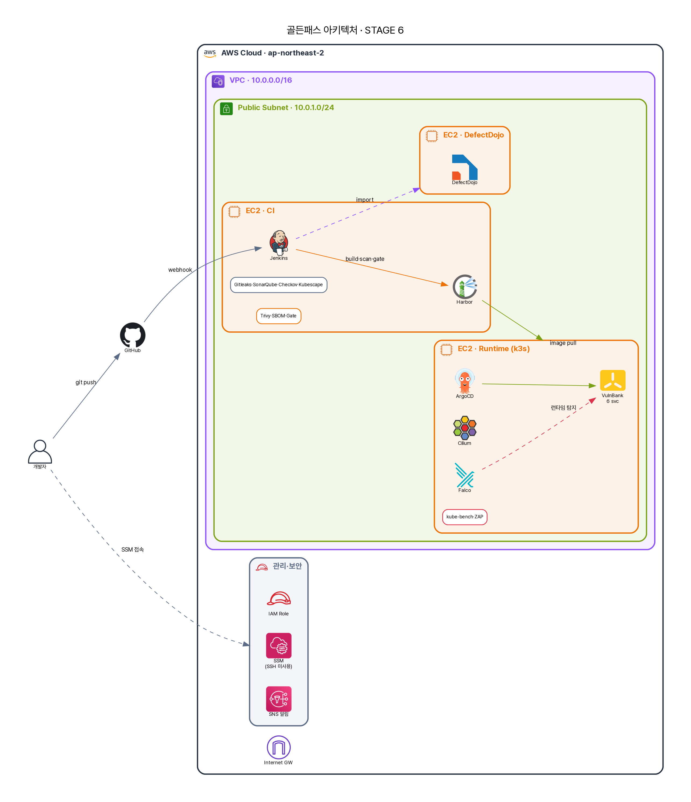

# 실전 교본 · 주니어 A의 골든패스 도입기

금요일 밤, 주니어 엔지니어 **A**의 슬랙이 울렸다. 시니어가 링크 하나를 던진다 — *"axios 또 털렸대. npm에서."* 그리고 한 줄 더. *"우리 결제팀, 안전한 거 맞아?"*

A는 답을 몰랐다. 회사엔 스캐너가 있었다. 그런데 "안전하냐"는 질문 앞에서, 댈 수 있는 **숫자도 근거도** 없었다. 월요일, 미션이 떨어진다.

> *"배포 전에 우리 코드가 안전한지 **판단**하고, 그 **근거를 남기는** 파이프라인. 네가 처음부터 만들어봐."*

이건 A가 빈손에서 시작해, **사건이 터질 때마다 도구를 하나씩 배우며**, 마침내 *"그래서 axios를 막을 수 있냐"*는 질문에 **정직하게** 답하게 되는 기록이다. 매 화는 이렇게 흐른다 — **① 사건(문제) → ② A의 좌충우돌 → ③ "왜 이 도구인가" → ④ 실제로 써본다(진짜 코드·결과) → ⑤ 한계와 면접 포인트 → ⑥ 다음 사건으로.**

## 사건 목차

| 화 | 터진 사건 | A가 배우는 무기 | STAGE |
| --- | --- | --- | :---: |
| [1 · "그거 어디서 돌릴 건데요?"](01-infra.md) | 검사 돌릴 곳도, 안전한 접속도 없다 | terraform · SSM | 1 |
| [2 · "근데 이걸 누가 다 돌려요?"](02-pipeline.md) | 도구는 깔렸는데 *엮이지* 않았다 | Jenkins 파이프라인 · REPORT_DIR 규약 · 게이트 | 2 |
| [3 · "API 키가 깃허브에 올라갔어요"](03-gitleaks.md) | 동료가 실수로 시크릿 커밋 | Gitleaks | 2 |
| 4 · "음수로 송금했더니 잔액이 늘어요" | 로직 버그 — SAST가 **0/4로 못 잡는다** | SonarQube의 충격 | 2 |
| 5 · "남의 거래내역이 보여요" | IDOR — 정적분석의 사각 | DAST가 메운다 | 2 |
| 6 · "컨테이너가 root로 돌아요" | 위험한 매니페스트 | Checkov · Kubescape | 2 |
| 7 · "이미지에 CVE가 6천 개?" | 베이스 이미지의 빚 | Trivy · SBOM | 3 |
| 8 · "어제 통과한 게 오늘 위험해졌어요" | axios식 0-day 공급망 | SBOM 시간축 재평가 | 3 |
| 9 · "등급 D인데 왜 통과됐죠?" | 게이트 설계의 함정 | Security Gate | 3 |
| 10 · "누가 운영 이미지를 손으로 바꿨어요" | 드리프트 | GitOps · ArgoCD | 4 |
| 11 · "악성코드가 데이터를 빼돌려요" | 런타임 C2 | Cilium egress *(근데 기본 미적용)* | 5 |
| 12 · "웹쉘이 떴는데 아무도 몰랐어요" | 런타임 침해 | Falco | 5 |
| 13 · "보안팀은 이걸 어디서 봐요?" | 흩어진 증적 | DefectDojo | 6 |
| 에필로그 · "그래서, axios를 막나요?" | — | **정직한 결론** | 6 |

## 세 가지 약속

<ul class="sb-points">
<li>진짜 코드·진짜 결과모든 코드·수치는 이 프로젝트의 *실제* 파일·*실제* 실행 결과다(SAST 0/4, 이미지 CVE 6천, egress DROPPED…). 지어내지 않는다.</li>
<li>실제로 '연결'한다"도구 깔았어요"가 아니라, *어느 파일의 어느 설정*으로 잇는지(Jenkins 파라미터·REPORT_DIR 규약·게이트 집계)를 보여준다.</li>
<li>시니어의 4가지 렌즈매 장 끝에 같은 통제를 **기술·규제·정책·관리(거버넌스)** 네 각도로 본다 — "막는다"가 과장이면 "탐지·완화"라 쓰는 정직과 함께.</li>
</ul>

## 처음과 끝

처음엔 **빈 VM 세 대**뿐이다. 12화를 지나면 아래 그림이 된다 — 그리고 에필로그에서, 이 그림이 *실제로 무엇을 막고 무엇을 못 막는지*를 따진다.

{ loading=lazy }
