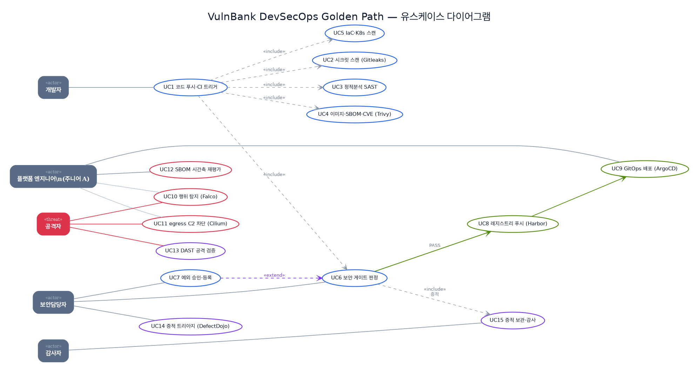

# 유스케이스로 본 시스템

아키텍처를 *컴포넌트*가 아니라 *누가 무엇을 하려 하는가*로 다시 그린다. 같은 골든 패스를, 개발자·보안담당자·공격자의 *목표*와 *흐름*으로 본다 — 보안은 결국 행위자들의 상호작용이기 때문이다.

{ loading=lazy }

## 액터 카탈로그

| 액터 | 유형 | 목표(왜 이 시스템과 상호작용하나) |
| --- | --- | --- |
| 개발자 | primary | 코드를 안전하게 배포한다. 푸시 한 번으로 검증이 돌기를 기대한다. |
| 플랫폼 엔지니어(주니어 A) | primary | 파이프라인·런타임·증적 체계를 세우고 운영한다. |
| 보안담당자 | primary | 게이트 정책·임계값을 정하고, 예외를 승인하며, 위험을 추적한다. |
| 감사자 | primary | "배포 전 검증했는가, 근거는 남았는가"를 증적으로 확인한다. |
| 공격자 | threat | 음수송금·IDOR·웹쉘·C2로 시스템을 침해하려 한다(=방어 검증 대상). |

## 유스케이스 인벤토리

| # | 유스케이스 | 주 액터 | 통제·도구 | 상태 |
| --- | --- | --- | --- | --- |
| UC1 | 코드 푸시·CI 트리거 | 개발자 | Jenkins | 실증 |
| UC2 | 시크릿 스캔 | (CI) | Gitleaks | 실증 |
| UC3 | 정적분석(SAST) | (CI) | SonarQube | 실증 |
| UC4 | 이미지 빌드·SBOM·CVE 스캔 | (CI) | Trivy·Syft | 실증 |
| UC5 | IaC·K8s 설정 스캔 | (CI) | Checkov·Kubescape | 실증 |
| UC6 | 보안 게이트 판정 | 보안담당자 | security-gate | 실증 |
| UC7 | 예외 승인·등록 | 보안담당자 | Exception-as-Code | 실증 |
| UC8 | 레지스트리 푸시 | 플랫폼 | Harbor | 실증 |
| UC9 | GitOps 배포 | 플랫폼 | ArgoCD | 부분 |
| UC10 | 런타임 행위 탐지 | 플랫폼·공격자 | Falco | 실증 |
| UC11 | egress C2 차단 | 플랫폼·공격자 | Cilium·Hubble | 실증 |
| UC12 | SBOM 시간축 재평가 | 보안담당자 | Trivy(sbom) | 실증 |
| UC13 | DAST 공격 검증 | 공격자 | verify.sh·ZAP | 실증 |
| UC14 | 증적 트리아지 | 보안담당자 | DefectDojo | 진행 중 |
| UC15 | 증적 보관·감사 | 감사자 | Jenkins archive | 실증 |

관계: **UC1 «include» UC2~UC6**(트리거가 검사를 포함) · **UC7 «extend» UC6**(예외가 게이트를 선택적으로 확장) · **UC6 → UC8 → UC9**(PASS 시 배포) · **UC6 «include» UC15**(판정이 증적을 남김).

---

## 주요 유스케이스 명세

표만으로는 *흐름*이 안 보인다. 핵심 네 개를 표준 유스케이스 서식(목표·사전조건·주 흐름·대안·사후조건/증적)으로 풀어 쓴다.

### UC6 · 보안 게이트 판정 (UC7 예외 포함)

- **목표** — 배포 전, 이번 빌드가 조직의 위험 허용선을 넘는지 *자동 판정*하고 그 판정을 증적으로 남긴다.
- **주 액터** — 보안담당자(정책 소유), Jenkins(집행)
- **사전조건** — UC2~UC5 스캔 결과가 `REPORT_DIR/<도구>/`에 적재됨. 게이트 임계값(`CRITICAL 0·HIGH 3`)·`ENFORCE_GATE`가 정의됨.
- **주 흐름**
    1. 게이트가 각 서비스의 Trivy 결과를 임계값과 비교한다.
    2. *예외 레지스터*(`security-exceptions.yaml`)를 검증한다 — 깨졌으면 **fail-closed**로 멈춘다.
    3. *활성(미만료)* 예외에 해당하는 finding은 차단 카운트에서 제외하되 `SUPPRESSED`로 기록한다.
    4. 예외 제외 후 카운트가 임계값 이내면 **PASS**, 초과면 **BLOCK**.
    5. 판정·임계값·예외·사유를 `msa-gate-summary.txt`에 남긴다.
- **대안 흐름**
    - *3a (UC7 extend)* — 보안담당자가 "도달 불가/위험 수용"을 근거·승인자·만료와 함께 레지스터에 등록 → 해당 finding은 만료 전까지 통과(증적엔 남음).
    - *3b* — 예외가 **만료**됨 → 자동으로 다시 차단되어 재검토 강제.
- **사후조건·증적** — `gate/msa-gate-summary.txt`에 `GATE_RESULT`·`SUPPRESSED`·`VIOLATIONS` 기록. → [예외·오탐 처리 구조](exception-handling.md)

### UC11 · egress C2 차단 (공급망 페이로드 봉쇄)

- **목표** — 침해된 파드가 외부 C2로 데이터를 빼돌리려는 시도를 런타임에 차단한다.
- **주 액터** — 공격자(시도), 플랫폼 엔지니어(정책), Cilium(집행)
- **사전조건** — 대상 네임스페이스에 egress default-deny `CiliumNetworkPolicy` 적용.
- **주 흐름**
    1. 공격자(또는 악성 의존성)가 파드 안에서 외부 IP로 연결을 시도한다.
    2. Cilium이 eBPF 데이터패스에서 정책을 평가한다.
    3. 허용 목록에 없는 목적지 → 첫 SYN을 **DROP**.
    4. Hubble이 DROP flow를 관측·기록한다.
- **대안 흐름** — *1a* 정책 미적용 시 egress가 열려 있어 차단되지 않음(이건 *기본값*이며 의도적 적용이 필요 — 정직한 한계).
- **사후조건·증적** — `curl http_code=000`/타임아웃, Hubble `DROPPED (TCP Flags: SYN)`. AWS 라이브 cmd `ba96945a`. → [런타임 보안](runtime-security.md)

### UC10 · 런타임 행위 탐지 (웹쉘·셸)

- **목표** — 실행 중인 컨테이너 안의 침해 행위(셸 실행, 웹 루트에 .php 생성)를 실시간 탐지한다.
- **주 액터** — 공격자(행위), Falco(탐지)
- **사전조건** — Falco가 워크로드보다 *먼저* 기동(또는 워크로드 재시작)되어 프로세스 귀속이 가능.
- **주 흐름**
    1. 공격자가 업로드한 웹쉘이 `move_uploaded_file`(=`rename` syscall)로 웹 루트에 쓰인다.
    2. Falco가 커널 syscall 스트림에서 룰과 매칭한다.
    3. `.php` 생성/셸 spawn → `Critical`/`Warning` 이벤트 발생(파드·네임스페이스 포함).
- **대안 흐름** — *2a* 룰이 실제 syscall(rename)과 어긋나면 미발화 → *룰을 실사격으로 검증*해야 함(이 프로젝트가 실제 겪고 수정한 지점).
- **사후조건·증적** — Falco `Critical PHP file written/moved`(18:31:55), 셸 spawn `Warning`. → [12화](textbook/12-falco.md)

### UC12 · SBOM 시간축 재평가 (어제 통과 → 오늘 위험)

- **목표** — 빌드 *이후* 새로 공개된 CVE가 이미 배포된 이미지에 영향을 주는지, 재빌드 없이 식별한다.
- **주 액터** — 보안담당자
- **사전조건** — 빌드 시점의 SBOM이 보관되어 있음(UC4의 산출물).
- **주 흐름**
    1. 신규 CVE가 advisory에 등재된다.
    2. 보관된 SBOM을 *오늘의* 취약점 DB로 `trivy sbom` 재스캔한다.
    3. 빌드 당시 없던 CVE가 매칭되어 영향 이미지를 식별한다.
- **사후조건·증적** — 재스캔에서 빌드 당시 없던 2026 CVE 3건 식별(`CVE-2026-23193` 등). → [8화](textbook/08-sbom-rescan.md)

---

## 정직한 경계

유스케이스는 *목표*를 그리지만, 모두가 같은 성숙도는 아니다. **UC9(GitOps)**는 ArgoCD Application은 정의됐으나 자동 동기화 상시 검증은 부분, **UC14(트리아지)**는 DefectDojo 통합이 진행 중이다. **UC11**의 차단은 *정책을 적용했을 때*만 성립한다(기본값 아님). 이 경계를 유스케이스마다 상태 배지로 표시한 이유다 — "할 수 있다"와 "지금 한다"는 다르기 때문이다.
